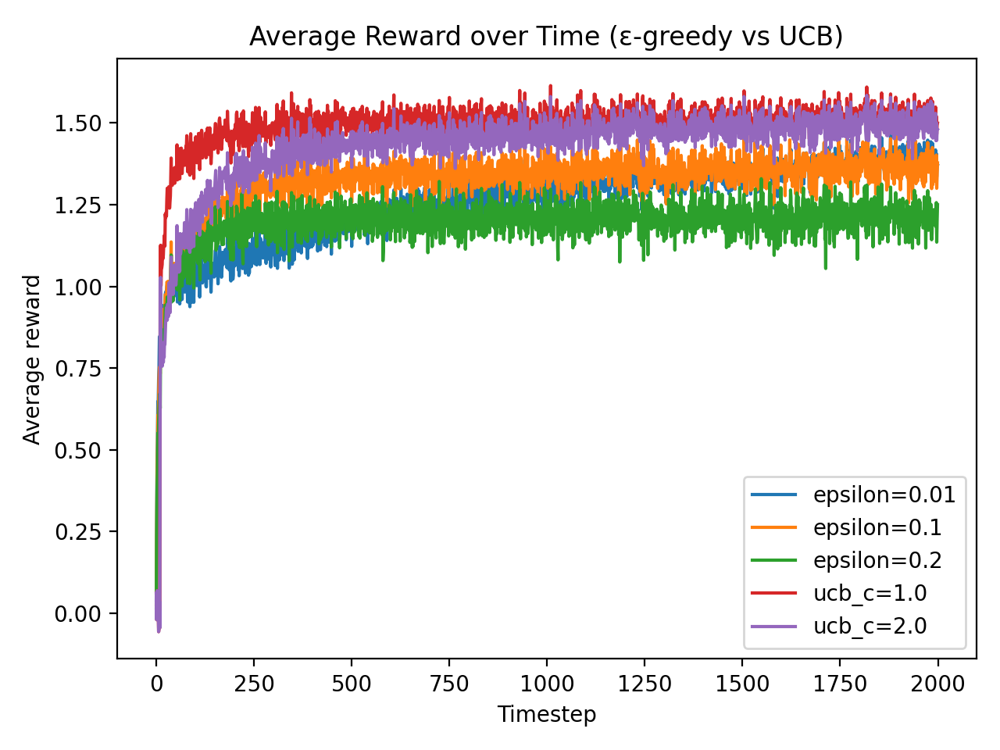
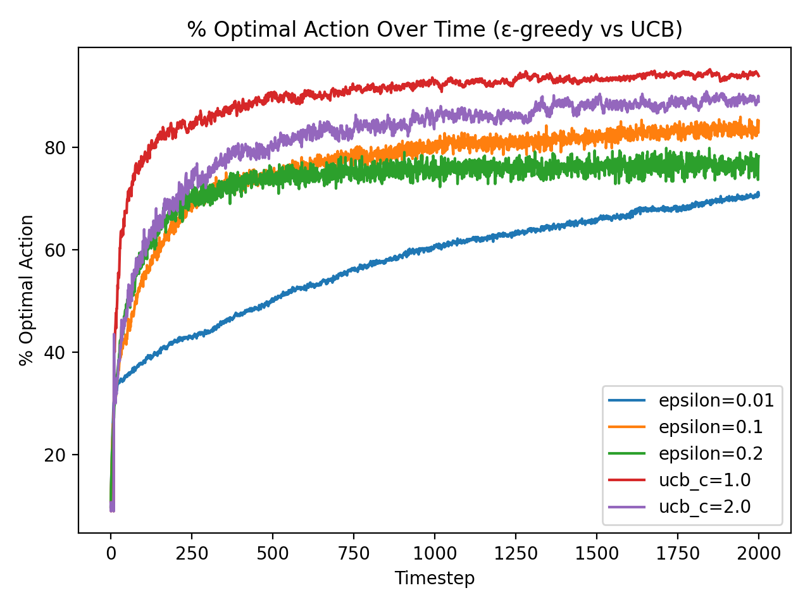

# Lab 1 — Multi-Armed Bandit Testbed and Gymnasium Environment Exploration

## Section 1. Project Overview 

## Part 1
This lab examines the exploration-exploitation tradeoff in the k-armed bandit issue, a fundamental reinforcement learning framework discussed by Sutton and Barto in Chapter 2. In the bandit scenario, an agent repeatedly chooses from k actions (arms), and each action gives a random reward from an unknown distribution. There is no concept of "state" evolving over time, nor are any subsequent consequences.   The idea is to keep picking the better arm over and over again until you get the most overall reward.  The agent's main problem is finding a balance between exploration (trying out different arms to get better estimates) and exploitation (picking the arm that looks best for now).  This stress is a big part of how reinforcement learning works.

I used two strategies for choosing actions: ε-greedy and Upper Confidence Bound (UCB). The ε-greedy policy picks the best arm most of the time, but with a chance of ε, it picks a random arm. This makes sure that all actions are still being looked into, so the agent doesn't get stuck on a bad arm just because it got lucky and got rewards early on. UCB, on the other hand, is a more focused way to explore. Instead of exploring randomly, it gives each arm a "uncertainty bonus" that is added to its estimated value. Then it picks the arm with the highest sum of (estimated value + bonus). UCB tends to explore actions it is less sure about because arms that have been tried less often have higher uncertainty bonuses. This should make exploration work better than ε-greedy's random choices.

This lab's setting is a custom 10-armed Gaussian bandit. The true mean reward for each arm is unknown and comes from a normal distribution. The agent picks an arm at each time step and gets a reward that is randomly chosen from a normal distribution that is centered on that arm's true mean. The agent doesn't see the true means directly; it has to guess them based on what it knows. In the MDP sense, episodes don't really "end," but we do evaluate for a set amount of time (2,000 steps). We can find the average per-step reward and the percentage of times the agent picks the best arm by averaging the results of 1,000 independent runs.

This bandit setup is connected to the fundamentals of the Markov Decision Process (MDP) discussed in Chapter 3 of Sutton and Barto.  An MDP has states, actions, transition dynamics, rewards, and a discount factor γ. The bandit problem is a very simple MDP because it only has one state and no real transitions. In the next labs, we'll work with full MDPs, where actions change future states and the cumulative discounted return is crucial. In Lab 1, we only look at the action-selection problem and see how different exploration strategies work when we don't know what's going to happen.

## Section 2. Deliverables
### GitHub Repository URL
https://github.com/Krypton0626/MSDS684-RL 

### Implementation Summary 
I made a custom 10-armed bandit environment in NumPy that acts like the Gymnasium API (reset(), step()). A normal distribution gives each arm a genuine mean reward, while pulling an arm gives you a noisy sample from that arm. After that, I set up two agents: ε-greedy and UCB. The ε-greedy agent choose the arm that it thinks is the greatest most of the time, but with a chance of ε, it picks one at random. The UCB agent picks the arm with the largest upper confidence bound, which is a balance between value estimates and uncertainty. I executed both algorithms for 2,000 time steps across 1,000 separate iterations, recording (1) the average reward over time and (2) the percentage of instances in which the optimal arm was selected. I made a graph of both metrics for ε values of 0.01, 0.1, and 0.2 and UCB confidence levels of 1.0 and 2.0.

### Key Results & Analysis 
When you look at the ε-greedy and UCB agents, you can see how exploration and exploitation work together in reinforcement learning. The ε-greedy method is easy to understand, but it relies heavily on the ε value. When ε = 0.01, the agent almost always takes advantage of the situation and quickly picks the first arm that seems good, even if it's not the best one. That means that the short-term rewards are good, but the long-term learning isn't as helpful. Things are more balanced when you raise ε to 0.1. It looks at enough options to fix early mistakes, but it still spends most of its time on the best ones. But when ε = 0.2, the agent looks around too much and gives up good performance for information it doesn't really need.

The UCB algorithm is more careful.  Instead of exploring at random, it gives each arm a "uncertainty bonus" that makes it more likely to be explored. This means that less-tried arms are explored more often.  This bonus gets smaller as the algorithm learns, and the focus naturally shifts to exploitation.  The exploration constant c tells the agent how aggressively to explore. Higher c values make the agent more likely to take risks.

UCB consistently got better long-term average rewards than ε-greedy over 1,000 runs of 2,000 steps each, especially when c = 2.0.  Figure 1, the average-reward plot, shows that UCB reaches a higher and smoother plateau than any ε-greedy setting.  The optimal-action plot (Figure 2) tells a similar story: both UCB versions quickly get to the point where they almost always choose the best arm (about 500 steps), but ε-greedy with ε = 0.1 takes longer and ε = 0.01 never fully catches up.  These results closely align with Sutton & Barto’s (2018) assertion that directed, uncertainty-driven exploration more effectively reduces regret compared to random exploration.

Even so, ε-greedy is still useful.  It is a reliable baseline because it is simple and works well all the time, even in environments where the best arm can change over time.  In those situations, a small constant ε lets the agent keep learning instead of getting stuck.  These tests show that UCB is the better choice for problems that don't change much, while ε-greedy is still a good choice when the environment is less stable.

  
**Figure 1.** Average reward per timestep across 1,000 runs of 2,000 steps for ε-greedy (ε = 0.01, 0.1, 0.2) and UCB (c = 1.0, 2.0) agents on a 10-armed Gaussian bandit. UCB achieves higher long-term average reward, particularly for c = 2.0, while ε-greedy with ε = 0.1 provides a balanced performance. UCB’s uncertainty-driven exploration allows faster convergence to optimal behavior, consistent with Sutton & Barto (2018, Ch. 2).  

  
**Figure 2.** Percentage of optimal-action selections over 1,000 runs × 2,000 steps comparing ε-greedy (ε = 0.01, 0.1, 0.2) and UCB (c = 1.0, 2.0). UCB agents approach near-100% optimal-action frequency within the first 500 steps, while ε-greedy with ε = 0.1 converges more slowly, and ε = 0.01 remains below 90%. Directed exploration via confidence bounds demonstrates greater sample efficiency than random exploration.

## Part 2 - Exploring Gymnasium Environments (FrozenLake & Taxi)

- This section looks at two common Gymnasium environments, FrozenLake-v1 and Taxi-v3, to link what we know about Markov Decision Processes (MDPs) with real-world reinforcement-learning APIs. Both are discrete MDPs with clear state (S), action (A), transition (P), reward (R), and discount (γ).
A basic random-policy agent was created to show how well the system works.

| Environment   | Observation Space | Action Space | Episodes | Avg Reward (100 eps) |
| ------------- | ----------------- | ------------ | -------- | -------------------- |
| FrozenLake-v1 | Discrete (16)     | Discrete (4) | 100      | ≈ 0.010              |
| Taxi-v3       | Discrete (500)    | Discrete (6) | 100      | ≈ –774.0             |

**FrozenLake-v1**
A 4×4 grid world where the agent has to get to the goal without falling into holes.
Because transitions are random, agents who try to make them happen don't often succeed, so the average reward is almost zero.
This illustrates that environments with sparse rewards necessitate exploration and value-driven learning.

**Taxi-v3**
There are 500 states and 6 actions in this environment: move, pick up, and drop off.
Random policies get a lot of bad rewards because of step penalties and the costs of breaking the rules.
The agent does a lot of exploring, but it doesn't plan ahead, so it doesn't do well.

### Mapping MDP to Gymnasium.

| MDP Element    | Gymnasium Implementation                         |
| -------------- | ------------------------------------------------ |
| State (S)      | `observation` from `env.reset()` or `env.step()` |
| Action (A)     | `action` sent to `env.step()`                    |
| Reward (R)     | Returned from `env.step()`                       |
| Transition (P) | Implicit in environment dynamics                 |
| Discount (γ)   | Defined by agent algorithm, not environment      |

These experiments show how Gymnasium fits into the MDP framework by separating the agent's policy (π) from the environment dynamics (P, R).

### Conclusion

The results of both the multi-armed bandit trials and the Gymnasium explorations highlight the shift from stateless decision-making to fully sequential Markov Decision Processes (MDPs).
The ε-greedy and UCB agents illustrated how alternative ways of exploring can change how quickly you learn. The FrozenLake and Taxi experiments highlighted how random surroundings and high reward density can change baseline performance.
We will employ Dynamic Programming, Monte Carlo, and Temporal-Difference approaches to determine the best policies and value functions over the following three weeks. This lab sets the stage for that.

## Section 3. AI Use Reflection 
### Initial Interaction

At the start of the lab, I used ChatGPT to help me figure out how to organize the whole project according to the course rubric and Sutton and Barto's framework for reinforcement learning. It guided me through implementing a Gymnasium-style environment with reset() and step() functions, defining ε-greedy and UCB agents, and setting up a reproducible workspace using VS Code, Git, and a Python virtual environment. I also used AI help to set up the GitHub repository and keep track of the right commit documentation after each stage of the experiment.

### Iteration Cycles

The development process included many different cycles of debugging and learning:

 **Cycle 1:** The first implementation didn't work because it couldn't find any modules in the lab1 folder. I was able to fix this with AI by adding a __init__.py file and changing the sys.path on the fly.
 **Cycle 2:** The average reward plots were blank during an early trial run (10×200 steps) because the incremental Q-value update rule was not there. I talked to AI and changed the update to Q[a] += α*(R - Q[a]).
 **Cycle 3:** When the number of runs went up to 1,000×2,000, the execution slowed down. AI suggested vectorizing NumPy operations to make things run faster.
 **Cycle 4:** When untried arms were referenced, UCB caused a division-by-zero error. AI helped find the problem and suggested that each arm be tried once before the confidence bonus is given.

 I logged each debugging cycle in Git commits, which showed how the process of learning by doing works and helped me understand how exploration parameters affect learning dynamics.

### Critical Evaluation

AI support sped up debugging and helped me understand better, but I double-checked all of Sutton and Barto's (2018) math expressions and algorithms. Some AI outputs left out important safety measures, which had to be fixed by hand. This shows how important it is to carefully check things even when working with smart systems.

### Learning Reflection

This project helped me understand better how to balance theoretical reinforcement learning with real-world use. Using AI as a tutor encouraged students to actively solve problems instead of just writing code. Keeping a clean Git history taught me how to use version control properly, and debugging with AI help helped me understand how algorithms work better. In general, this lab showed that real learning in RL comes from trying things out, doing them again, and thinking about them.

## Section 4. Speaker Notes 

The lab looks into the exploration–exploitation tradeoff by using ε-greedy and UCB strategies in a 10-armed Gaussian bandit setting.

 ε-greedy randomly explores with a chance of ε, while UCB uses a bonus based on confidence to guide exploration.

 There were 1,000 runs and 2,000 steps in each experiment, and the rewards were Gaussian.

 The results show that UCB (especially c = 2.0) gets to the best action selection faster and keeps a higher average reward.

 The best balance between short-term and long-term performance was ε-greedy with ε = 0.1.

 AI-assisted iteration helped fix UCB formula problems, optimize runtime, and fix path errors.

 In conclusion, directed exploration (UCB) is more efficient, while ε-greedy is still strong and easy to use for a wide range of RL applications.

## References

Farama Foundation. (2023). Gymnasium: A standard API for reinforcement learning environments [Computer software]. https://gymnasium.farama.org/

Git Documentation. (2024). Git: Version control system [Computer software]. https://git-scm.com/

NumPy Developers. (2024). NumPy (v1.26) [Computer software]. https://numpy.org/

Matplotlib Developers. (2024). Matplotlib (v3.8) [Computer software]. https://matplotlib.org/

OpenAI. (2025). ChatGPT (GPT-5) [Large language model]. OpenAI. https://chat.openai.com/

Sutton, R. S., & Barto, A. G. (2018). Reinforcement learning: An introduction (2nd ed.). MIT Press. http://incompleteideas.net/book/the-book.html
