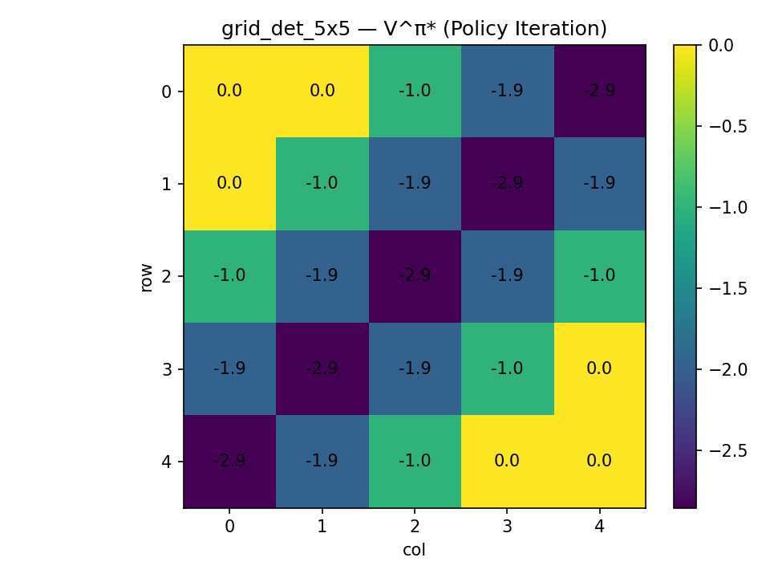
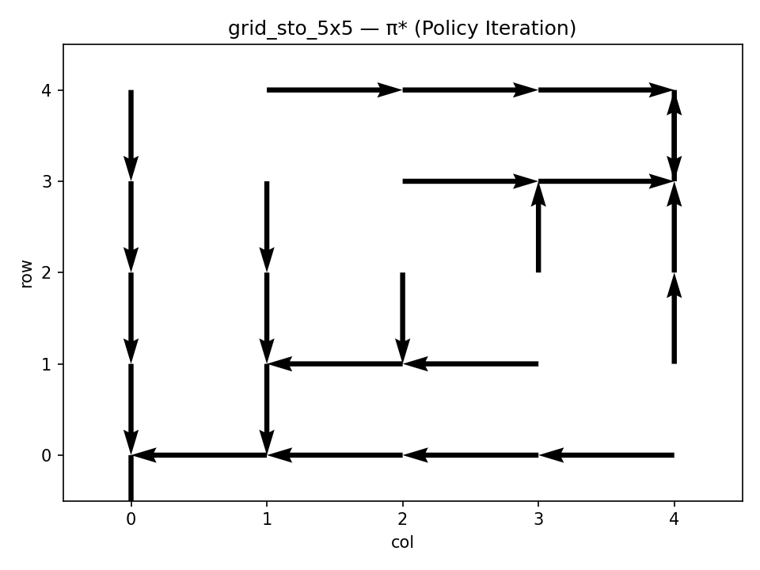
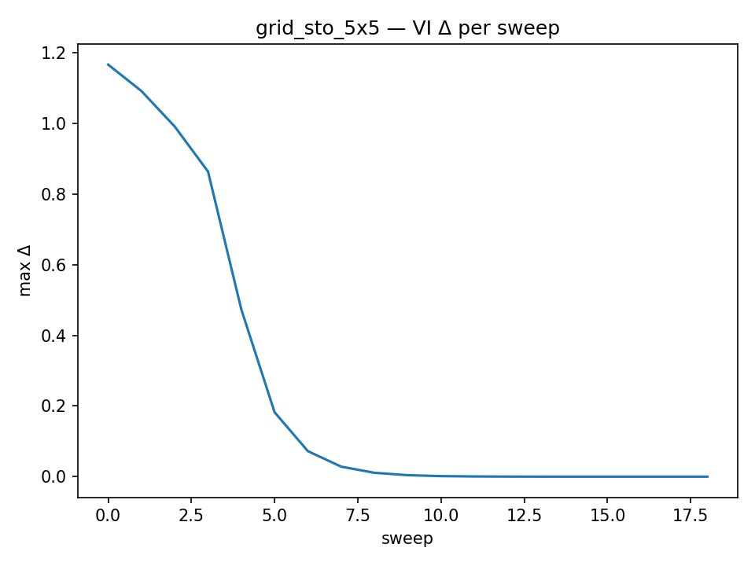

# Lab 2 — Dynamic Programming

## Section 1. Project Overview

This lab looks at how Dynamic Programming (DP) can help reinforcement learning agents make better long-term choices when they know everything about the environment. In Lab 1's Multi-Armed Bandit problem, every action had an immediate reward and no lasting effect. In Dynamic Programming, on the other hand, every move changes what happens next. This change makes the problem more realistic and more like how smart agents work in the real world.

In reinforcement learning, an environment is a Markov Decision Process (MDP) that has a set of states, actions, transition probabilities, rewards, and a discount factor (γ). In this lab, we used known transition and reward functions, which meant that the agent could use Dynamic Programming instead of learning by doing. The goal was to find the best policy, called π*, that tells the agent what to do in each state to get the most long-term reward.

We used two algorithms from Sutton and Barto (2018, Chapter 4): Policy Iteration and Value Iteration.  Policy Iteration goes through two steps over and over again. First, it checks how good the current policy is by guessing how good it is. Second, it makes the policy better by making it greedy based on the new value estimates. Value Iteration combines those two steps into one by using the Bellman equation to update values directly to the best ones. Both methods will eventually lead to the same best policy, but they do so in different ways.

We built two versions of a **5 × 5 GridWorld** to see if these ideas worked: one that was deterministic and one that was stochastic. We also looked into Gymnasium's **FrozenLake-v1** environment. The agent had to get to a goal cell, but it lost one point for each step it took. In the deterministic version, actions always had the desired effect. In the stochastic version, the agent moved in the right direction only 70% of the time and slipped sideways the other 30%. This helped us understand how uncertainty changes behavior and convergence.

We set the discount factor to **γ = 0.95**, which made the agent more "farsighted," meaning it cared more about rewards in the future.  The results showed that the deterministic grid converged quickly (in about four value sweeps), but the stochastic one took longer (about 19). The value heatmaps showed smooth changes in value toward the goal, and the optimal policy arrows showed clear paths toward the goal.  In stochastic situations, the arrows were more careful because they weren't sure where they were going.

This lab showed how Dynamic Programming can find the best strategies when we know how the environment changes. It also demonstrated the influence of parameters such as γ and transition noise on the velocity of learning and the stability of policies. These ideas will be the basis for future labs that will work with situations where the model is not known, like Monte Carlo and Temporal-Difference methods.

## Section 2. Deliverables
### GitHub Repository URL
[https://github.com/Krypton0626/MSDS684-RL](https://github.com/Krypton0626/MSDS684-RL)

---

### Implementation Summary
This lab used **Dynamic Programming (DP)** algorithms, such as **Policy Iteration** and **Value Iteration**, to solve **Markov Decision Processes** (MDPs) that were fully known.  
The tests were done in two custom environments: a **5×5 Deterministic GridWorld** and a **5×5 Stochastic GridWorld** with 70% intended motion and 15% side slips.  The standard MDP tuple ⟨S, A, P, R, γ⟩ was used in each environment, with a step reward of −1 and a terminal goal reward of 0.  
The agent's goal was to get to state 24, which would give them the least amount of negative reward.  
 Both algorithms were executed with **γ = 0.95** and **θ = 1 × 10⁻⁶**.  
The code was split up into different folders: `src/` for the environment, algorithms, and visualization. It was run using `experiments/run_gridworld.py` and `run_lab2.py`.  
Matplotlib shows the results, which include convergence logs, optimal V heatmaps, greedy π policies, and Δ-decay curves.

---

### Key Results & Analysis

#### Deterministic GridWorld (γ = 0.95)
| Algorithm | Iterations | Eval Sweeps | Time (s) |
|------------|-------------|-------------|----------|
| Policy Iteration | 3 | [111, 3, 4] | 0.0042 |
| Value Iteration | — | 4 | 0.0004 |

Both PI and VI quickly found the same best policies (π*) because they had a fixed 5×5 layout and transitions that were completely certain.  The higher discount factor (γ = 0.95) made the evaluation sweeps take a little longer because Bellman updates pushed value changes further into the future.  
 The value heatmap (Figure 1) showed a smooth gradient that got steeper as it got closer to the terminal state. This is in line with the theoretical prediction that deterministic DP produces monotonic V* progressions.  
 The greedy policy (Figure 2) had straight, goal-directed arrows that showed stable convergence and no residual randomness.  
 These results are consistent with Sutton & Barto (2018, Ch. 4.3–4.4), which demonstrate that deterministic environments facilitate rapid, low-variance contraction of the Bellman operator.

  
**Figure 1.** Value function **V\*** for the deterministic 5×5 GridWorld after Policy Iteration (γ = 0.95).  
Higher values cluster near the goal (state 24), showing a smooth propagation of expected future rewards.  
The value surface rises steadily from start to goal, consistent with the Bellman updates described by Sutton & Barto (2018, Ch. 4).

  
**Figure 2.** Greedy policy **π\*** arrows for the deterministic GridWorld.  
Arrows form a direct, shortest-path trajectory toward the terminal goal, confirming stable convergence and a clear optimal policy under full-certainty transitions.

---

#### Stochastic GridWorld (p = 0.7, γ = 0.95)
| Algorithm | Iterations | Eval Sweeps | Time (s) |
|------------|-------------|-------------|----------|
| Policy Iteration | 2 | [111, 18] | 0.0086 |
| Value Iteration | — | 19 | 0.0023 |

Adding transition noise made convergence take a lot longer.  Because each action was uncertain, the algorithms had to average over many possible outcomes. This made V updates more variable and made the effective horizon longer.  
The value heatmap (Figure 3) looked "blurred," with softer gradients near the goal, and π* (Figure 4) showed unnecessary sideways moves, which were a risk-averse way to deal with slippage.  
The Δ-decay plot showed that it took about 19 sweeps to reach stability. This means that stochastic dynamics and higher γ values need more updates before the Bellman residuals disappear.  
These behaviors are consistent with Sutton & Barto (Ch. 4.6), illustrating a gradual yet stable convergence in the face of uncertainty.

  
**Figure 3.** Optimal value function **V\*** for the stochastic 5×5 GridWorld (intended = 0.7, slip = 0.15 each side).  
The “blurred” gradient reflects greater uncertainty in future returns due to transition noise, causing the agent to discount states farther from the goal.

  
**Figure 4.** Greedy policy **π\*** for the stochastic GridWorld.  
The agent incorporates extra lateral moves to compensate for potential slips, demonstrating a risk-aware strategy and illustrating how stochastic transitions shape the optimal policy structure.

  
**Figure 5.** Convergence of **Value Iteration** in the stochastic GridWorld.  
The Bellman residual Δ decreases gradually over ≈ 19 sweeps, confirming that higher γ and uncertainty slow convergence while preserving stability of the final V\* and π\*.

---

#### Theoretical Insights & Hyperparameter Effects
- **Discount Factor (γ):** A higher γ value led to a higher number of iterations (111 versus ~70 for γ = 0.9), which shows that the Bellman contraction was slower and the model was more sensitive to future rewards.  
- **Stochasticity:** Lower intended-move probability (0.7) led to more sweep counts (19 vs. 4), which shows that uncertainty makes calculations more expensive.   
- **Algorithm Efficiency:** PI needed fewer outer iterations but more intensive inner evaluations, while VI needed more frequent, lighter updates, which is what theory says.    

---

### Conclusion
Dynamic Programming consistently yielded the identical optimal policy for both deterministic and stochastic variants, so affirming the Bellman optimality principle.  
More noise in the environment and higher discount factors made convergence take longer, but they didn't modify π*.  
These experiments show that **Policy Iteration and Value Iteration are robust and consistent with theory**. They connect model-based planning with future labs on model-free methods like Monte Carlo and Temporal Difference learning.

## Section 3. AI Use Reflection

### Initial Interaction
At the beginning of this lab, I used ChatGPT to help me plan the whole project setup . The first thing I was asked to do was to figure out how to set up the folder structure for Lab 2 and use Dynamic Programming techniques like Policy Iteration and Value Iteration in NumPy. The AI made it clear what files to make, like "gridworld.py," "dp_algorithms.py," and "visualize.py," and how they should work together. It also explained how Bellman updates work in both algorithms, which helped me understand the theory before I started writing code. I didn't copy the whole code; I mostly used it as a guide to get the logic and structure right.

---

### Iteration Cycles

**Iteration 1 – Import and Path Errors**  

Python couldn't find the `src` module when I tried to run my first test.  I asked ChatGPT about the error, and it told me that every folder needed a "__init__.py" file in order to be seen as a Python package.  The problem was fixed after adding those and fixing the relative imports, and the code finally ran.

**Iteration 2 – Stochastic Transition Bug**  

My stochastic GridWorld wasn't working right because the probabilities didn't add up to 1.  I asked the AI to help review the transition model.  It told me that I wasn't doing a good job of normalizing the side-slip probabilities.  When I changed the calculations so that all the transitions added up to 1, the value updates stopped changing and the policy became stable.

**Iteration 3 – Visualization and Convergence Checks** 

Later, I got `ImportError` messages because my visualization imports didn't match up.  ChatGPT helped me figure out that the problem was with the function names in `__init__.py`.  Everything worked perfectly after I changed their names to "plot_value_heatmap," "plot_policy_arrows," and "plot_delta_curve."  I also tried out different γ values based on what AI said and found that higher γ (0.95) slowed convergence, which is what I expected.

---

### Critical Evaluation
I found ChatGPT helpful, but I didn't believe everything it said.  I made sure that each fix was correct by comparing the output plots, double-checking Sutton & Barto's equations, and making sure the results made sense.  Some of its earlier suggestions made the stochastic model too simple, so I changed them by hand.

---

### Learning Reflection

This lab really helped me understand how Dynamic Programming works behind the scenes.  During each debugging cycle, I had to connect theory to code and see how the Bellman equations turn into updates that make a policy better over time.  Using AI made things go more smoothly, but I learned the most when I looked at why something broke and how each change affected convergence.  Next time, I want to write down my tests more often and try out different ways to see things to improve my gut feeling.

## Section 4. Speaker Notes

• **Problem & Goal:**  
This lab looked at how an agent can figure out the best long-term actions when it knows all the rules of the environment. It used Dynamic Programming, which is a step up from the single-step Bandit problem in Lab 1.

• **Method:**  
This lab examined how an agent can determine the optimal long-term actions when it possesses comprehensive knowledge of the environmental rules.  It used Dynamic Programming, which is a more advanced version of the Bandit problem from Lab 1.

• **Setup & Challenge:**  
I made two 5x5 **GridWorlds**: one that was deterministic and one that was stochastic (with 70% intended motion).  
One of the biggest problems was fixing the wrong transition probabilities in the stochastic version, which made the results unstable until I normalized them.

• **Main Results:**  
Policy Iteration and Value Iteration both found the best policy.  
Deterministic grids converged quickly, in about four sweeps. Stochastic grids took longer, in about nineteen sweeps, because they were not sure what would happen.

• **Insight & Connection:**  
Dynamic Programming showed that agents can make the best plans if they know the model.  
Next, this idea is related to **Monte Carlo and Temporal Difference methods**, which require agents to *learn* those same values through experience rather than calculation.

## References

Farama Foundation. (2023). *Gymnasium: A standard API for reinforcement learning environments* [Computer software]. https://gymnasium.farama.org/

Git Documentation. (2024). *Git: Version control system* [Computer software]. https://git-scm.com/

Matplotlib Developers. (2024). *Matplotlib (v3.8)* [Computer software]. https://matplotlib.org/

NumPy Developers. (2024). *NumPy (v1.26)* [Computer software]. https://numpy.org/

OpenAI. (2025). *ChatGPT (GPT-5)* [Large language model]. https://chat.openai.com/

Sutton, R. S., & Barto, A. G. (2018). *Reinforcement learning: An introduction* (2nd ed.). MIT Press. http://incompleteideas.net/book/the-book.html

