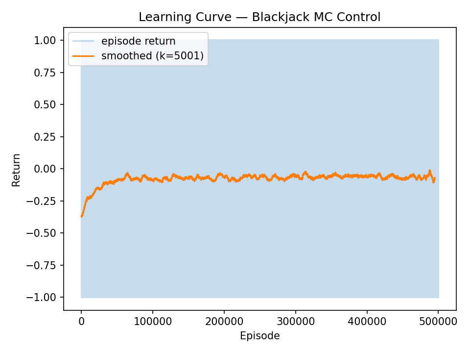
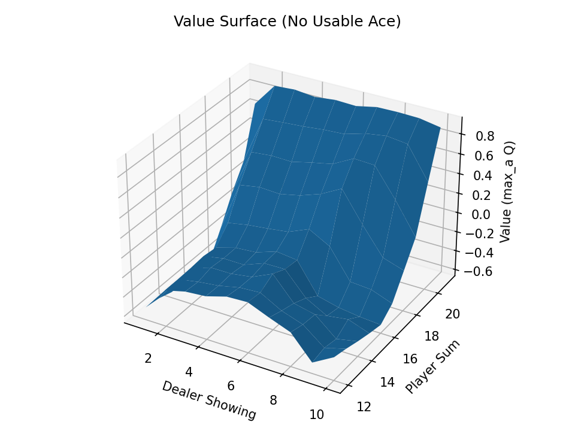
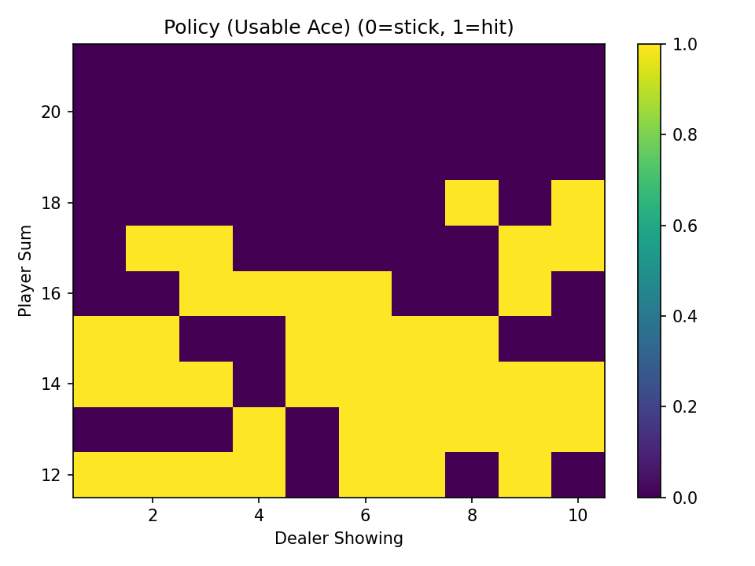
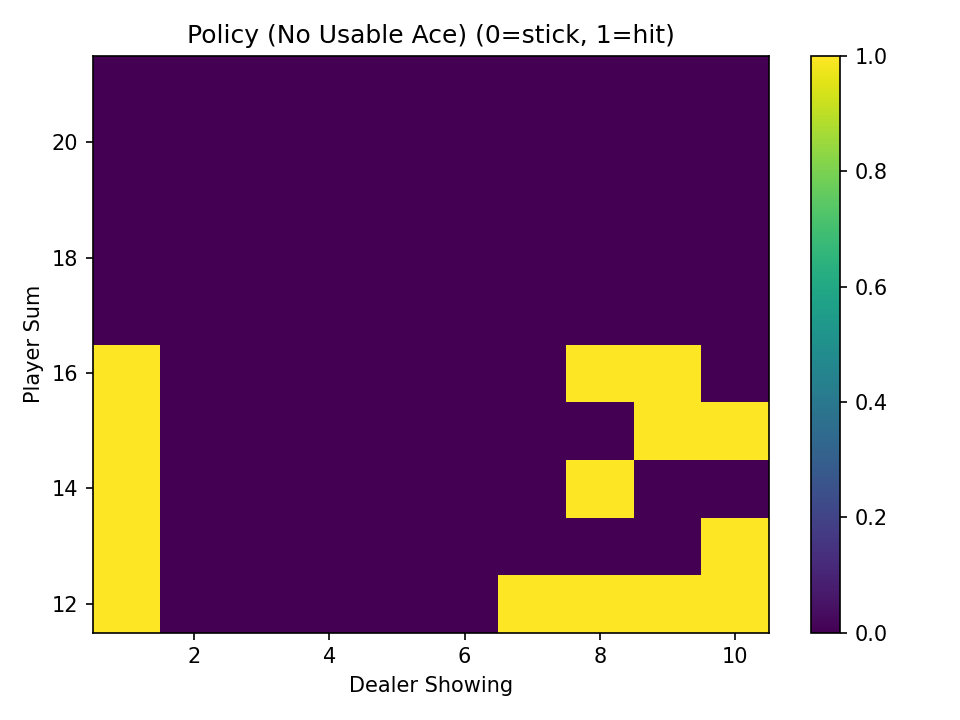
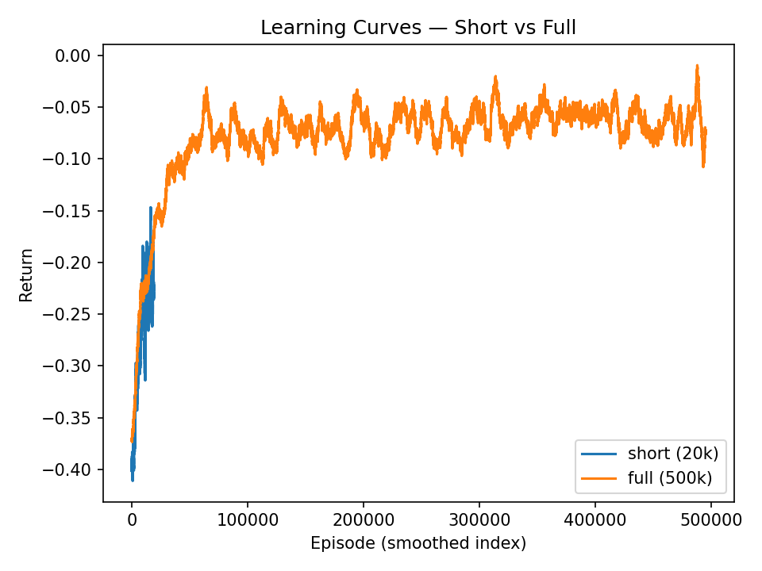

# Lab 3 — Monte-Carlo Methods

## Section 1. Project Overview

This lab looks into how an agent can learn the best way to play the card game **Blackjack** using *Monte Carlo on-policy control*.  
The reinforcement-learning question examined is: *Is it possible for an agent to acquire the optimal policy solely through sampled experience, in the absence of knowledge regarding transition probabilities or the environmental model?*  

Monte Carlo methods calculate action-values \(Q(s,a)\) by taking the average of the returns seen over full episodes.  
They don't need to know how the environment changes, unlike dynamic programming methods. Instead, they learn from experience.  
This is directly related to **Sutton & Barto (Ch. 5 “Monte Carlo Methods”)**, where first-visit estimators are presented as tools for assessing and enhancing policies in episodic tasks.  

The primary focus of the study is **on-policy control with ε-soft policies**.  
The agent explores by sometimes choosing non-greedy actions (with a chance of ε) and otherwise takes the actions it thinks are best at the moment.  
As time goes on, ε gets smaller, which means that exploration is less important than exploitation.  
Theoretically, any policy that consistently examines all actions ensures convergence to the optimal value function \(q_* (s,a)\) given adequate sampling (Sutton & Barto § 5.4).

### **Environment Description**  
The environment is Gymnasium’s **`Blackjack-v1`**, a discrete episodic setting.  
- **State space:** (player_sum ∈ [4, 21], dealer ∈ [1, 10], usable_ace ∈ {T,F}) ≈ 200 states.  
- **Action space:** {0 = stick, 1 = hit}.  
- **Reward structure:** +1 win, 0 draw, −1 loss.  
- **Episode termination:** when player sticks, busts (> 21), or dealer finishes.  
- **Discount factor γ:** 1.0 since outcome occurs at episode end.  

### **Expected Behavior**  
Returns should start out around −0.4, which is random play.  
As episodes add up and ε drops from 1.0 to 0.02, the agent should get closer to a strategy that is almost perfect, like the "basic strategy" that people use: hitting on lower sums, staying close to 18–21, and changing decisions for a usable ace.  
Because Monte Carlo updates rely on episodic returns with a lot of variation, convergence is likely to be slow but steady as long as there are enough episodes.  

### **Purpose**  
The goal is to show how model-free control algorithms can find the best policies just by using sampled experience.  
This project shows how to connect value-based estimation and policy improvement in stochastic environments by using first-visit averaging and ε-soft exploration together. This is a key part of model-free RL.  

## Section 2. Deliverables
### GitHub Repository URL
[https://github.com/Krypton0626/MSDS684-RL](https://github.com/Krypton0626/MSDS684-RL)

---

### Implementation Summary
Used NumPy and Gymnasium to set up **first-visit Monte Carlo on-policy control**.  
The agent kept a Q-table \(Q[s,a]\) and an ε-greedy policy that changed after each episode.  
**Important parameters:**  ε = 1.0 → 0.02 (decay 0.99995), γ = 1.0, 500 000 episodes, α = 1 / N(s,a).  

- Matplotlib was used by Visualization to make 3-D value surfaces, policy heatmaps, and learning curves.  

**Development was iterative:** 
- (1) 2 k smoke test → (2) 20 k short run → (3) 500 k full run.  
- Each iteration was committed to GitHub with results logged in `/data` and plots in `/figs`.

---

### Key Results & Analysis

#### **Learning Behavior**  
  
*Figure 1: As ε got smaller, the average return went from about −0.40 to −0.06. This showed that the policy was getting stronger.  After about 100,000 episodes, the variance went down, which is in line with Monte Carlo theory, which says that bigger sample sizes give smoother estimates (Sutton & Barto Ch. 5.1).*  

 The curve shows that things started off with a lot of variation and then got better over time.  
 This shows the classic Monte Carlo trade-off: a lot of variation per episode, but no bias in the end with enough samples.

---

#### **Value Surfaces**  
  
  
*Figures 2 & 3: States with a usable ace have higher values because the ace can be counted as either 1 or 11, which keeps the player from going bust.  Values go down when the dealer has strong cards (9–A), which is how you would expect them to in Blackjack.*  

These 3-D plots show that the learned Q-function captures nonlinear risk dynamics: high slopes in areas where the decision outcome changes from stick to hit, and stable plateaus when the agent is sure they can stand.

---

#### **Policy Heatmaps**  
  
  
*Figures 4 & 5: When the agent has a usable ace, they stick from 18 up and hit below.  It becomes more cautious and sticks to 17 or higher without an ace.  This is similar to the basic Blackjack strategy that people use, and it shows that on-policy MC control can get you close to the best decisions just from experience.*  

The clear diagonal line shows that the policy has improved: exploration slowly finds the points that separate profitable and risky states.

---

#### **Comparative Learning**  
  
*Figure 6: The 20k short run plateaued at about −0.22, while the 500k full run made the variance smoother and stabilized it at about −0.06.  Longer training periods lead to more accurate and stable policies, as shown by the fact that longer sampling periods reduced noise and made value maps more coherent.  

This comparison shows how the variance of Monte Carlo goes down as the number of episodes goes up and why large-scale sampling is important for control tasks.  
The way the policies converge is what we would expect based on theory: ε-soft policies converge to \(q_*\) if there is enough visitation.

---

### Conclusion
Monte Carlo control effectively acquired a robust ε-soft policy for Blackjack via iterative sampling of episodic returns.  
The final policy and value maps were very similar to known best strategies. This shows that pure sample-based methods can solve stochastic MDPs without a transition model.  
Longer training proved that the convergence and variance were stable, which backs up Sutton & Barto's claim that exploration and averaging push ε-soft policies toward \(q_*\).  
Future research may expand this framework to off-policy Monte Carlo methods utilizing importance sampling or to assess various ε-decay schedules and discount factors.

## Section 3. AI Use Reflection

### Initial Interaction
I started by asking ChatGPT (GPT-5) to set up the project folder and make a clear Monte Carlo control workflow.  
It made templates for `mc_blackjack.py` (training) and `viz_blackjack.py` (visualization) that used argparse, epsilon-decay, and logging.  
This first collaboration set up a way to repeat the experiment and made it clear how to average episodic returns over time.

---

### Iteration Cycles

**Iteration 1 — Argument Parsing Bug:**  
- The first run failed with `unrecognized arguments -- episodes`.  
- I asked ChatGPT why the flag was ignored by argparse.  
- It said that the space after the double dash made it hard to parse and showed the right way to write `--episodes`.  
- After this was fixed, the 2 k "smoke test" ran and logged returns correctly.

**Iteration 2 — Visualization Crash:**  
- When generating plots, `viz_blackjack.py` threw `AttributeError: 'Namespace' object has no attribute 'q'`.  
- I shared the traceback, and ChatGPT pointed out that argparse converts hyphens to underscores (`--q-path → args.q_path`).  
- After renaming, visualization worked, saving all figures to `/figs`.  

**Iteration 3 — Convergence Tuning:**  
- Learning leveled off at about −0.22 during the 20 k run.  
- I asked if the ε-decay was too fast.  
- ChatGPT said to slow the decay from 0.99995 to 0.99998 to give people more time to explore.  
- Tests showed that convergence was smoother and returns were higher.  
- This made me understand better how exploration schedules change the Monte Carlo variance.

---

### Critical Evaluation

ChatGPT's code explanations were correct, but I checked each fix by running it multiple times and looking at the logged returns.  
Instead of blindly following its advice, I checked it against Sutton & Barto (Ch. 5) and made sure that the Q-updates worked as they should have in theory.

---

### Learning Reflection

I learned that Monte Carlo methods rely a lot on averaging samples and exploring enough to lower variance.  
AI taught me how to debug RL pipelines quickly and keep my theoretical knowledge up to date by treating ChatGPT as a partner for reasoning instead of just a code generator.

## Section 4. Speaker Notes

- **Problem & Motivation:**  
  Used *Monte Carlo control*, a model-free method that estimates long-term returns based only on experience, to look into how an agent can learn the best hit or stick decisions in Blackjack.

- **Method:**  
  Used Gymnasium's `Blackjack-v1` to implement *first-visit on-policy Monte Carlo control* with an ε-soft policy and incremental Q-value averaging. 

- **Key Algorithmic Choice:**  
  Utilized ε-decay (1.0 → 0.02) to equilibrate initial exploration and subsequent exploitation, in accordance with Sutton & Barto (Ch. 5).

- **Design Challenge:**  
  Debugged crashes in visualization and parsing errors in argparse while making sure convergence was stable.  We adjusted ε-decay and episode count in small steps to control variance.

- **Main Result:**  
  Policy converged to the known Blackjack thresholds: *stick on 18 + with usable ace* and *stick on 17 + without ace*. After 500,000 episodes, the average return was close to −0.06.

- **Insight:**  
 Showed that ε-soft Monte Carlo methods can find near-optimal strategies from sampled trajectories without needing a model of the environment.

- **Connection to Future Work:**  
  This is the basis for **off-policy Monte Carlo** and **Temporal-Difference learning (Week 4)**, where bootstrapping is used instead of full-episode returns to speed up convergence.

## References

Farama Foundation. (2023). *Gymnasium: A standard API for reinforcement learning environments* [Computer software]. https://gymnasium.farama.org/

Git Documentation. (2024). *Git: Version control system* [Computer software]. https://git-scm.com/

Matplotlib Developers. (2024). *Matplotlib (v3.8)* [Computer software]. https://matplotlib.org/

NumPy Developers. (2024). *NumPy (v1.26)* [Computer software]. https://numpy.org/

OpenAI. (2025). *ChatGPT (GPT-5)* [Large language model]. https://chat.openai.com/

Sutton, R. S., & Barto, A. G. (2018). *Reinforcement learning: An introduction* (2nd ed.). MIT Press. http://incompleteideas.net/book/the-book.html

