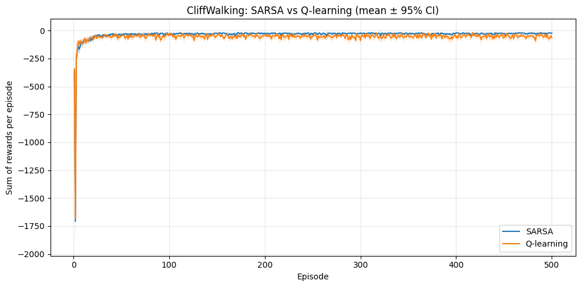
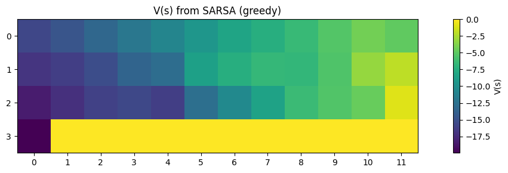
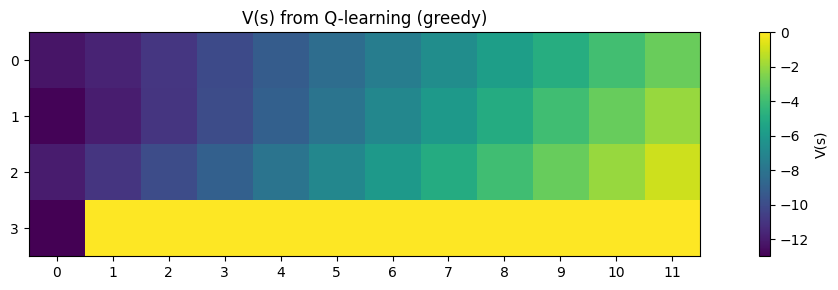
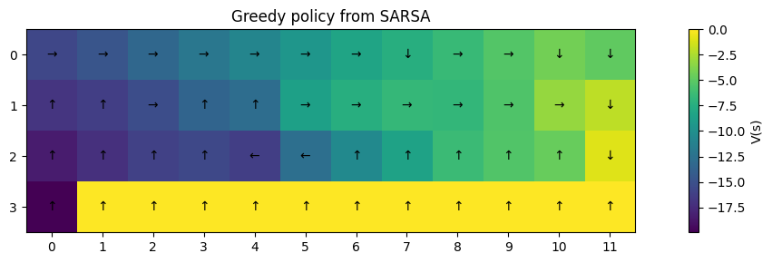
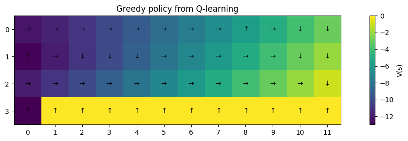
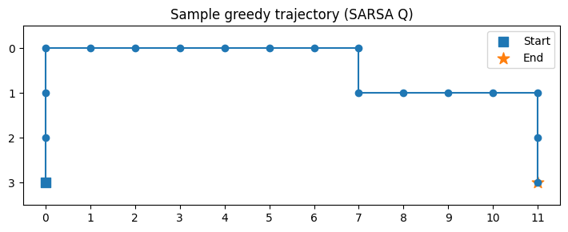
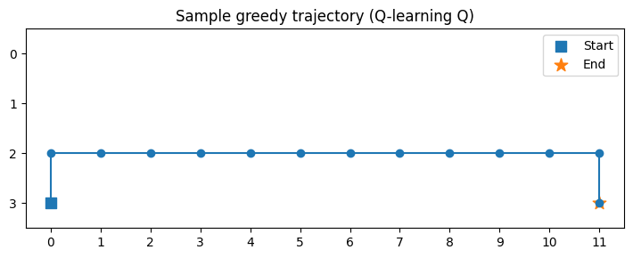

# Lab 4- Temporal Differences

## Section 1. Project Overview

This lab looks at how **Temporal-Difference (TD) learning** lets an agent learn the best way to act by making small changes over time instead of waiting for full episode returns.  The principal inquiry examines: **What are the differences in behavior between SARSA (on-policy TD control) and Q-learning (off-policy TD control) within the CliffWalking environment, and what accounts for the divergent learned policies resulting from their TD update rules?**

In Chapter 6 of Sutton & Barto, TD learning is explained. TD(0) is introduced as a way to connect Dynamic Programming and Monte Carlo methods.  After each step in the environment, TD updates value estimates using the target:

`R_{t+1} + γ * V(S_{t+1})`

which allows the agent to learn online instead of waiting for full episodes.

In this lab, TD prediction is extended to control through two algorithms:

- **SARSA (on-policy):**  
  Uses the TD target  
  `R_{t+1} + γ * Q(S_{t+1}, A_{t+1})`  
  and learns the value of the ε-greedy behavior policy.

- **Q-learning (off-policy):**  
  Uses the TD target  
  `R_{t+1} + γ * max_a Q(S_{t+1}, a)`  
  and learns the value of the greedy optimal policy.

### Environment Description

The project uses Gymnasium's "CliffWalking-v1," a 4×12 gridworld that shows the difference between safe and best behavior.

- **State space:** 48 discrete grid cells  
- **Action space:** 4 actions (up, right, down, left)  
- **Rewards:** −1 per step, −100 for cliff, 0 for goal  
- **Episode termination:** falling off the cliff or reaching the goal  
- **Discount factor:** γ = 1.0  

### Expected Behavior

Theory predicts:

- **SARSA** will learn a *safer path* away from the cliff because it looks at the ε-greedy policy, which still sometimes explores.
- **Q-learning** will find the "optimal but risky cliff-edge path" because it looks at the greedy policy no matter what.

### Purpose

The goal of this lab is to show how TD bootstrapping makes online learning faster and how **on-policy vs. off-policy TD control** leads to different behaviors learned in environments with high-penalty transitions.  This lab shows the theoretical and practical effects of different TD update targets by comparing SARSA and Q-learning in CliffWalking.

## Section 2. Deliverables
### GitHub Repository URL
[https://github.com/Krypton0626/MSDS684-RL](https://github.com/Krypton0626/MSDS684-RL)

---

### Implementation Summary

This lab uses Gymnasium's "CliffWalking-v1" environment to test two Temporal-Difference control algorithms: SARSA (on-policy TD control) and Q-learning (off-policy TD control). Both methods use an ε-greedy exploration strategy and update a tabular Q-function online after each step in the environment.  

The experiment has 500 episodes and 30 random seeds, and the hyperparameters are `α = 0.5`, `γ = 1.0`, and `ε = 0.1`. We ran both algorithms separately for each seed and kept track of their returns for each episode. We used NumPy for Q-tables and TD updates, and Matplotlib for visualizations like learning curves, value heatmaps, greedy policies, and example trajectories. The repository has all the plots and data in the folders `/lab4/data` and `/lab4/figs`.

---

### Key Results & Analysis

#### **Learning Curves (Mean ± 95% CI)**  
  
**Figure 1:** *SARSA converges to a safer but slightly longer path, reflected by less negative average returns compared to Q-learning. Q-learning shows more volatility because its off-policy updates do not account for exploration risk. This matches Sutton & Barto (Ch. 6), where SARSA is predicted to behave conservatively while Q-learning aggressively optimizes the greedy target.*

Across 30 seeds, SARSA’s average return stabilizes higher (less negative) than Q-learning because it avoids falling into the cliff during exploration. Q-learning, while capable of reaching the optimal shortest path, incurs frequent −100 penalties during learning due to exploratory steps pushing the agent over the cliff. The confidence intervals reflect this: Q-learning exhibits significantly higher variance across episodes, consistent with off-policy TD’s sensitivity to exploratory transitions.

---

#### **State-Value Heatmaps**  
  
**Figure 2:** *SARSA assigns lower values to states near the cliff because it predicts the possibility of exploratory actions leading to catastrophic penalties. This demonstrates how on-policy TD incorporates stochastic behavior into the value landscape.*

  
**Figure 3:** *Q-learning assigns higher values near the cliff edge because it evaluates the greedy target policy, which assumes perfect execution and no exploration. This produces a sharper, more optimistic value ridge along the optimal path.*

The heatmaps show how bootstrapping changes the learned value function in different ways. The value function of SARSA is smoother and more cautious, while the value function of Q-learning has a clear high-value band right next to the cliff. This is the best path if actions are always greedy.

---

#### **Policy Visualizations**  
  
**Figure 4:** *SARSA’s greedy policy stays one row above the cliff, taking a longer but safer route. This matches the theoretical expectation that on-policy algorithms must account for future exploratory actions.*

  
**Figure 5:** *Q-learning’s policy hugs the cliff edge, selecting the shortest optimal route. Because Q-learning evaluates the maximal next-state value, it ignores the consequences of occasional random actions and thus learns a risk-seeking policy.*

Policies make it clear how on- and off-policy bootstrapping are different.  Even though they trained with the same ε-greedy behavior policy, the policies they end up with are very different.

---

#### **Sample Greedy Trajectories**  
  
**Figure 6:** *SARSA’s trajectory veers safely away from the cliff, echoing its more risk-averse value function.*

  
**Figure 7:** *Q-learning takes the optimal shortest path directly along the cliff edge. This highlights why Q-learning is optimal but risky during learning.*

The trajectory examples show how each algorithm works when it uses the policy it learned. SARSA always stays away from dangerous areas, while Q-learning always takes the shortest route.

---

### Conclusion

This lab shows how **TD bootstrapping** lets you learn from raw interactions online and how the structure of the TD target affects the policy that is learned. Because SARSA is on-policy, it learns a careful strategy that works in situations where exploration is risky. Q-learning is off-policy, so it learns the best greedy policy, but it has a lot of variation and cliff penalties while it learns.  

The results are exactly what Sutton and Barto predicted in Chapter 6. They show that on-policy and off-policy TD control lead to very different behaviors, even when the exploration schemes are the same. This lab shows how important it is to know what assumptions algorithms make when picking RL methods for tasks that are very important for safety.

## Section 3. AI Use Reflection

### Initial Interaction
I began this lab by asking ChatGPT to help outline the full TD learning workflow for SARSA and Q-learning using Gymnasium’s `CliffWalking-v1`. My initial prompt requested a clean project skeleton mirroring my earlier labs. The AI generated a directory structure, separate algorithm and utility files, and a multi-seed experiment runner. This gave me a working plan for implementing and comparing on-policy and off-policy TD control.

---

### Iteration Cycles

**Iteration 1 — Import Errors (ModuleNotFoundError).**  
Python couldn't import `td_algos` when I ran `run_lab4.py`. I sent the traceback to ChatGPT, and it told me that relative imports inside a package need either "from lab4.td_algos import ..." or an empty "__init__.py" file. The import system worked after I changed the imports to absolute paths and added the package initializer. This helped me figure out the difference between top-level and package-relative module resolution in Python.

**Iteration 2 — Seeding Bug (Identical Episodes).**  
The learning curves for my first TD runs were almost the same for each episode. I asked ChatGPT why exploration seemed broken. It found the problem: I was resetting the environment with the same seed *inside* every episode loop, which made the randomness stay the same throughout the whole run. The AI said that seeds should only be set once during training, not once for each episode. After taking `reset(seed=seed)` out of the inner loop, SARSA and Q-learning acted normally in a random way.

**Iteration 3 — Environment Deprecation Crash.**  
The experiment failed with a "DeprecatedEnv" error because "CliffWalking-v0" is no longer available in newer versions of Gymnasium. I asked ChatGPT what to do about this. It said that the right name for the environment is "CliffWalking-v1," which uses the same API.  The error was fixed by updating the environment string, and all seeds were able to run without any problems.

---

### Critical Evaluation
I ran small smoke tests (5 seeds × 50 episodes) again to make sure that every AI-generated fix worked. I checked Sutton & Barto (Ch. 6) twice to make sure that the behavior fit with TD theory in two cases.  The AI didn't make any big mistakes, but I learned to check each change instead of just following the suggestions.

---

### Learning Reflection
This debugging process taught me how small implementation details, like seeding, imports, and terminal handling, can have a big effect on how RL works. Working with AI sped up the development cycle by giving me immediate hypotheses and explanations, but I still had to test them out in the lab. I learned to think of the AI as a partner in reasoning rather than just a source of answers, especially when I was using algorithms where small mistakes can change how learning works.

## Section 4. Speaker Notes

- **Problem & Motivation:**  
  This lab uses Temporal-Difference (TD) learning to look at how on-policy and off-policy TD control methods work in the CliffWalking environment, which has high-penalty transitions (the cliff).

- **Method:**  
  Used Gymnasium to make two TD control algorithms: **SARSA** (on-policy) and **Q-learning** (off-policy).  Both used ε-greedy exploration and changed the Q-values online after every "env.step()".

- **Key Algorithmic Choice:**  
  SARSA used the TD target `R + γ * Q(next_state, next_action)` to check the behavior policy, while Q-learning used `R + γ * max_a Q(next_state, a)` to check the greedy target policy.  This difference tells us how each algorithm deals with the risk of exploration.

- **Experimental Setup:**  
  With `α = 0.5`, `γ = 1.0`, and `ε = 0.1`, I ran each algorithm for **500 episodes × 30 random seeds**.  Gathered return curves, value heatmaps, policies, and sample greedy paths.

- **Main Result:**  
  SARSA learned a "safe path" that went around the cliff, while Q-learning learned the "shortest optimal but risky path" that went along the edge of the cliff.  During training, Q-learning had more variation in its learning curves and more penalties for falling off cliffs.

- **Insight:**  
  This experiment illustrates the practical significance of on-policy versus off-policy learning.  On-policy TD takes into account how people actually explore, while off-policy TD looks at how a perfect greedy policy would work.  This results in fundamentally divergent policies in contexts where errors incur significant costs.

- **Connection to Future Work:**  
  Deep RL methods like Deep Q-Networks (DQN), which use Q-learning with neural networks, and policy gradient methods, which directly optimize policies without relying on TD target maximization, are based on these differences.

## References

Farama Foundation. (2023). *Gymnasium: A standard API for reinforcement learning environments* [Computer software]. https://gymnasium.farama.org/

Git Documentation. (2024). *Git: Version control system* [Computer software]. https://git-scm.com/

Matplotlib Developers. (2024). *Matplotlib (v3.8)* [Computer software]. https://matplotlib.org/

NumPy Developers. (2024). *NumPy (v1.26)* [Computer software]. https://numpy.org/

OpenAI. (2025). *ChatGPT (GPT-5)* [Large language model]. https://chat.openai.com/

Sutton, R. S., & Barto, A. G. (2018). *Reinforcement learning: An introduction* (2nd ed.). MIT Press. http://incompleteideas.net/book/the-book.html

