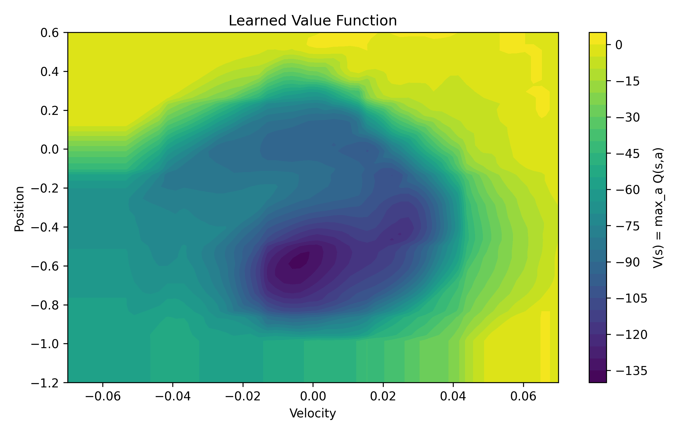
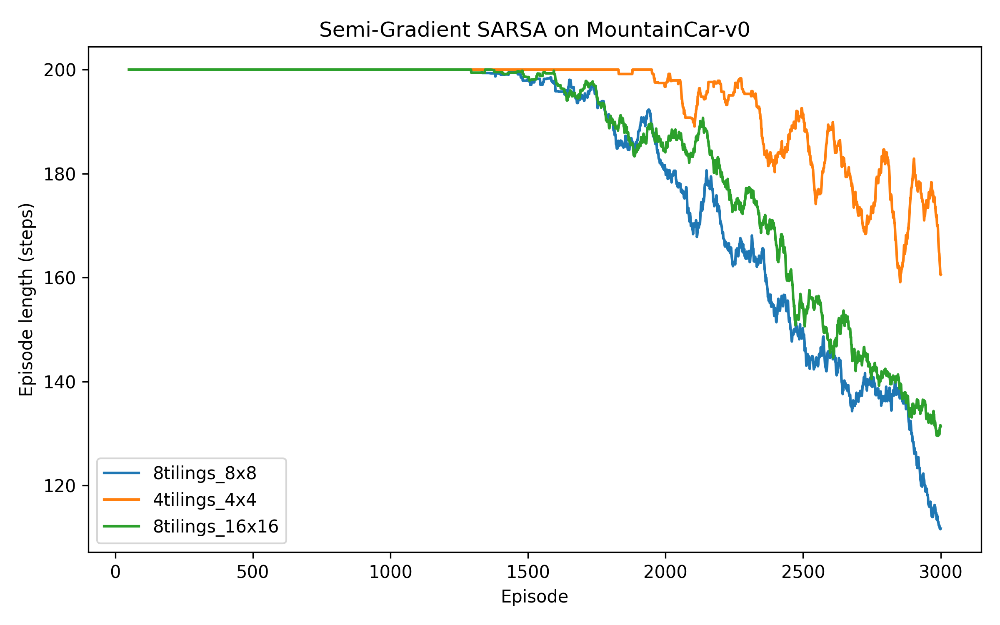
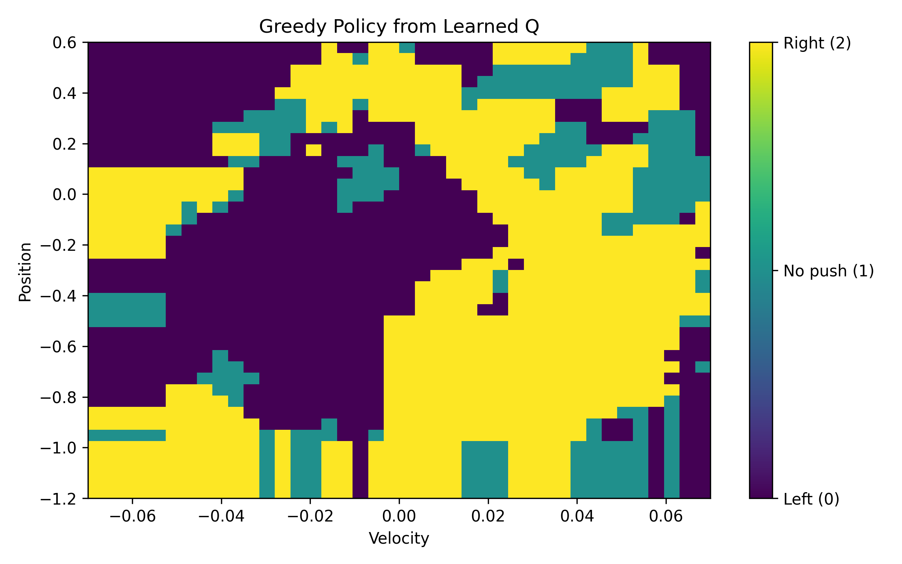
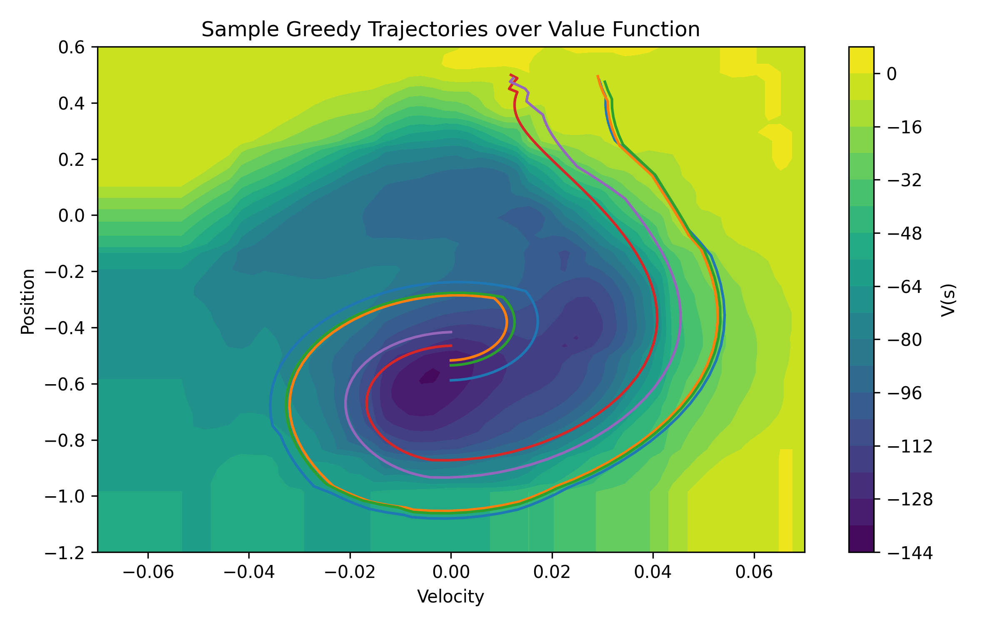

# Lab 5 – The Multi-Armed Bandit Problem and MDP Foundations

## Section 1. Project Overview

This laboratory exercise explores a key change in reinforcement learning: the shift from simple, discrete tabular methods to more advanced function approximation techniques. These techniques are designed to handle continuous state spaces. Earlier methods used tables to store value estimates, which worked well in situations with a limited number of possible states. However, this method becomes impractical when states are continuous or very large. MountainCar-v0 is a prime example of this difficulty. The environment's state space is defined by two continuous variables: position and velocity, which can take on a wide range of numerical values. Because a table would require an infinite number of entries, function approximation is essential. 

This laboratory exercise aims to learn an action-value function \(Q(s,a)\) using linear function approximation, specifically through **tile coding**, a feature-construction method introduced in Sutton & Barto (Ch. 9–10). Tile coding works by breaking the continuous state space into several overlapping grids. Each tiling creates a rough grid. Combining several offset tilings allows for local generalization, smoother value representations, and more efficient learning, which helps to reduce overfitting. Instead of learning values for specific states, the agent learns a weight vector. This vector is used to convert tile-coded feature vectors into approximate \(Q(s,a)\) values.

To train the agent, this laboratory employs **semi-gradient SARSA**, an on-policy temporal-difference control algorithm. Semi-gradient methods simplify on-policy learning by treating bootstrapped targets as constants, thereby ensuring stability. This approach circumvents the instability frequently associated with the "deadly triad"—the combination of function approximation, bootstrapping, and off-policy data—which can induce divergence in algorithms such as Q-learning when function approximation is utilized. 

MountainCar-v0 presents a control problem characterized by an underpowered agent. The car's inability to directly ascend the right hill necessitates a strategy of swinging left and right to build up momentum. The reward system provides a penalty of -1 at each timestep until the goal is reached, making the episode length a direct measure of how well the system performs. This study examines how different tile-coding setups, like 8×8, 4×4, and 16×16 tiles, affect the learning rate, stability, and the quality of the policy. I expect that more detailed tile configurations will create more expressive representations, but they will also require more episodes to learn effectively. In contrast, less detailed tile configurations might learn quickly but lack precision, which could lead to suboptimal policies. Therefore, the balance between these two extremes is a key part of the generalization theory in reinforcement learning.

---

## Section 2. Deliverables

### GitHub Repository URL  
**https://github.com/Krypton0626/MSDS684-RL**

---

### Implementation Summary

This lab project implements semi-gradient SARSA, using tile-coded linear function approximation, to solve the continuous-state MountainCar-v0 environment. The project has three main parts:

1. **TileCoder:** A configurable class is used to create overlapping tilings and convert a continuous state into a sparse binary feature vector. Each tiling activates exactly one tile, which results in a feature vector with `num_tilings` active features.

2. **Semi-Gradient SARSA:** A training loop that updates separate weight vectors for each action:  
   \[
   w[a] \leftarrow w[a] + \alpha \left(R + \gamma Q(S',A') - Q(S,A)\right) x(S).
   \]  
   ε-greedy exploration is used, and α is scaled by the number of tilings.

3. **Visualization Tools:** Learning curves, value-function heatmaps, greedy policy visualizations, and trajectory overlays were generated using scripts. Three configurations were evaluated: **8 tilings × 8×8 tiles**, **4 tilings × 4×4 tiles**, and **8 tilings × 16×16 tiles**; each was trained for 3,000 episodes. All results were stored in `lab5/data` and `lab5/figs`, and the complete experiment can be run from the repository's root directory using `python run_lab5.py`.

---

### Key Results & Analysis

Below are the four core visualizations selected for this lab, each demonstrating a different aspect of how the agent learned with tile-coded semi-gradient SARSA.

---

#### **Figure 1. Learned Value Function (8 Tilings × 8×8 Tiles)**  

The heatmap illustrates the estimated state-value function \(V(s) = \max_a Q(s,a)\) throughout the continuous MountainCar state space. The deep valley indicates low-value states situated near the hill's base, where the car necessitates numerous steps to achieve the goal. As position and velocity increase, regions of higher value become apparent. Tile coding yields a smooth, locally-generalized surface, in contrast to a jagged grid, thereby demonstrating how overlapping tilings efficiently approximate continuous environments.

---

#### **Figure 2. Learning Curves Across Feature Configurations**  

This plot compares the episode lengths over 3,000 training episodes for three tile-coding configurations:  
- 8 tilings × 8×8 tiles (best performance)  
- 4 tilings × 4×4 tiles (coarse, underfits)  
- 8 tilings × 16×16 tiles (fine-grained, learns slower)

The 8×8 configuration shows the fastest learning and stabilizes after about 115 steps. In contrast, coarser features generalize too much, which prevents the model from learning precise decision boundaries. High-resolution features, while effective, require significantly more data.

---

#### **Figure 3. Greedy Policy Derived From Learned Q-values**  

The policy map illustrates the greedy action chosen for each position–velocity combination. The agent's selection of "push left" in areas necessitating backward motion to ascend the right hill aligns precisely with the expected behavior in MountainCar. Consequently, as velocity increases, the policy transitions to "push right." This visualization serves to validate that the learned Q-function effectively generates the optimal strategy for generating back-and-forth momentum.

---

#### **Figure 4. Greedy Trajectories Overlaid on the Value Function**  

Each colored curve shows a greedy path, starting from different initial states. The agent first moves upward through less valuable states, gaining momentum, and then follows a narrow, high-value path toward the goal. This visual representation connects the learned value landscape with the policy being used, demonstrating how semi-gradient updates change the value surface.

---

### Conclusion

This lab exercise illustrates the utility of function approximation in facilitating the effective operation of reinforcement learning agents within continuous environments, a domain where tabular methods are often inadequate. Tile coding offered a robust and easily understood feature representation, and semi-gradient SARSA successfully acquired a momentum-based control policy for MountainCar-v0. The conducted experiments underscore the significance of feature resolution in influencing learning behavior, thereby corroborating fundamental principles from Sutton & Barto concerning generalization, stability, and the mitigation of the deadly triad. These foundational elements will serve as a precursor to Week 6, during which nonlinear function approximators, specifically neural networks, will be employed to further develop these concepts within the framework of deep reinforcement learning.

---

## Section 3. AI Use Reflection

### Initial Interaction

Initially, I used artificial intelligence to help create the basic structure of the TileCoder class and the semi-gradient SARSA implementation. My first questions were about designing overlapping tilings, figuring out which tiles were active, and organizing the project. The AI provided an initial template, which I used as a starting point, expecting to go through several debugging steps.

---

### Iteration Cycles

**Iteration 1 — TileCoder faults**  
The initial test revealed that the tile coder failed to activate the appropriate quantity of tiles. I inquired of ChatGPT regarding the discrepancy between `features.sum()` and the expected number of tilings. The AI identified an error in the computation of the offsets. Following a revision of the offset logic, the tile coder subsequently generated the anticipated one-hot activation for each tiling.

**Iteration 2 — No improvement in episode length**  
The SARSA algorithm's episode length plateaued at 200 for a considerable number of iterations. Upon querying the AI regarding potential underlying factors, it proposed a solution: scaling the learning rate by dividing α by the number of tilings. Subsequent to implementing this adjustment, a marked enhancement in the learning process was observed.

**Iteration 3 — Runner script confusion**  
Running `runner_lab5.py` straight from the terminal resulted in a command error. I turned to ChatGPT for an explanation, and it pointed out that Python scripts need to be run with `python run_lab5.py`. Once I made that adjustment, the complete experiment, from start to finish, ran without a hitch.

---

### Critical Evaluation

While the AI offered valuable insights, I did not accept any response without independent confirmation. Every explanation was cross-referenced with both Gymnasium documentation and Sutton & Barto's work. Initial AI outputs included extraneous code or unfounded assumptions regarding the MountainCar reward system, which I subsequently rectified. The tile coder's functionality was validated through controlled test cases, and I observed weight updates and Q-values throughout the training process to confirm their accuracy.

---

### Learning Reflection

Through iterative debugging facilitated by AI, I developed a more nuanced comprehension of tile coding's role in local generalization and the significance of scaling the learning rate for stability. Furthermore, my grasp of semi-gradient methods and the influence of the value landscape on the resultant policy was reinforced. While AI accelerated the implementation process, the core learning stemmed from meticulous testing, error identification, and the consistent application of theoretical principles to each correction. Consequently, in forthcoming laboratory sessions, I intend to maintain AI as a collaborative tool, while simultaneously prioritizing experimentation and theoretical validation at each stage.

---

## Section 4. Speaker Notes

- The objective of this laboratory exercise was to progress from tabular reinforcement learning (RL) to scalable function approximation techniques. 

- Tile coding was employed to transform the continuous state space of the MountainCar environment into sparse binary feature vectors.

- A semi-gradient SARSA algorithm was then implemented, utilizing distinct weight vectors for each possible action. Three different tile configurations were evaluated: 8×8, 4×4, and 16×16 grids. 

- The 8-tilings 8×8 configuration demonstrated the most favorable equilibrium between expressiveness and the rate of learning. Value-function heatmaps and policy plots provided evidence of intuitive momentum-building behavior. 

- The primary conclusion drawn from this experiment is that feature resolution has a significant impact on both generalization capabilities and the stability of the learning process.

---

## References

Farama Foundation. (2023). *Gymnasium: A standard API for reinforcement learning environments* [Computer software]. https://gymnasium.farama.org/  

Git Documentation. (2024). *Git: Version control system* [Computer software]. https://git-scm.com/  

Matplotlib Developers. (2024). *Matplotlib (v3.8)* [Computer software]. https://matplotlib.org/  

NumPy Developers. (2024). *NumPy (v1.26)* [Computer software]. https://numpy.org/  

OpenAI. (2025). *ChatGPT (GPT-5)* [Large language model]. https://chat.openai.com/ 
 
Sutton, R. S., & Barto, A. G. (2018). *Reinforcement learning: An introduction* (2nd ed.). MIT Press. http://incompleteideas.net/book/the-book.html  
