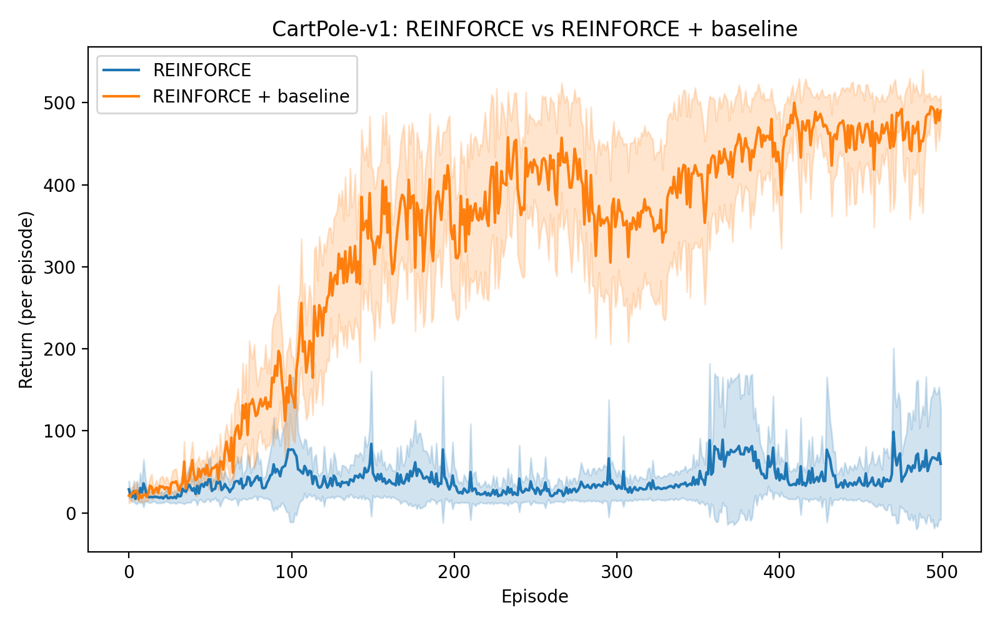
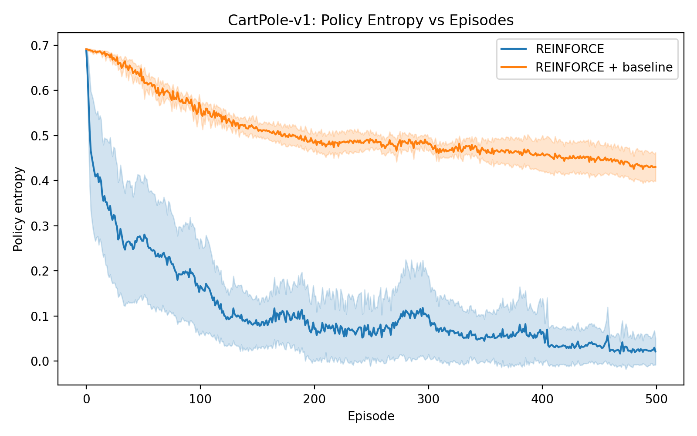

# Lab 6 – Policy Gradient Methods on CartPole

## Section 1. Project Overview

This lab investigates policy gradient reinforcement learning through the REINFORCE algorithm and its enhanced variant incorporating a learned value baseline.  Policy gradient methods directly optimize a parameterized policy, while value-based methods like Q-learning or SARSA estimate action values and choose actions based on those values. This change is important because it lets us show smooth, stochastic policies and easily move to continuous action spaces, which was a problem with earlier tabular and value-function methods.  Sutton and Barto (2018, Chapter 13) stress that policy gradients give more stable updates because small changes in parameters only cause small changes in behavior. This is not always the case with greedy value-based updates.

In this lab, we use a small neural network in PyTorch to represent the policy and automatic differentiation to calculate gradients from start to finish. The target environment is **CartPole-v1**, which is a clear and well-known standard for testing policy learning. The state space is a 4D vector that changes over time and describes the position, speed, angle, and angular speed of the cart and pole. The "action space" is made up of two choices: moving the cart to the left or right. The agent gets a +1 reward for every timestep that the pole stays balanced.  When the pole falls past a certain angle, the cart moves too far from the center, or 500 steps are reached, the episode ends. CartPole is a good place to study Monte Carlo policy learning because the agent doesn't get a shaped reward and needs long-horizon credit assignment.

The first method used is "vanilla REINFORCE," which calculates returns at the end of each episode and uses the policy gradient theorem to move the policy toward actions that give higher returns. This method is theoretically sound, but it has a lot of variance because the Monte Carlo returns are noisy. To fix this, the second method uses a **value-function baseline** that takes an estimated \( V(s) \) away from the return before figuring out the gradient. This doesn't change the expected direction of the gradient, but it does lower the variance a lot, which makes learning faster and more stable. This idea is very important in modern actor-critic algorithms.

I thought that the baseline version would be faster and more stable than vanilla REINFORCE before I ran the experiments. This was especially true for a task like CartPole, where early episodes give very noisy return estimates.  I also thought that the policy entropy, which shows how "stochastic" the policy is, would start out high and slowly go down as the agent learned a more certain way to balance. The theory says that vanilla REINFORCE should have much more erratic updates, which could cause entropy to collapse too soon. The baseline version, on the other hand, should keep exploration smoother and more consistent.

In general, this lab is about figuring out how direct policy optimization works, how variance affects Monte Carlo gradient estimates, and why baselines, which are one of the easiest changes to make, are so important for making policy gradient learning stable.

---

## Section 2. Deliverables

### GitHub Repository URL  
**https://github.com/Krypton0626/MSDS684-RL**

---

### Implementation Summary

With PyTorch, I made two policy gradient algorithms: **vanilla REINFORCE** and **REINFORCE with a value baseline**. Both methods used a fully connected neural network to set the parameters for the policy, which then gave action logits for the two discrete actions in CartPole. For the baseline version, I added a different value network that learns to use mean squared error to get close to \( V(s) \).

The training loop had a structure that was like an episodic Monte Carlo.  The agent made a path for each episode based on its current policy. We used discounted summation with \( \gamma = 0.99 \) to figure out the returns. The policy update for vanilla REINFORCE used \( -\log\pi(a|s)G_t \).  The baseline version used an advantage term \( (G_t - V(s)) \) in the gradient, which lowers variance.  

To test stability, I trained **10 random seeds** for each method, saved the returns and policy entropies for each episode, and then combined them across seeds. All runs used 500 training episodes, Adam optimizers, and learning rates that were set separately for the policy and baseline networks.  A single runner script was used to run the training and testing so that the results could be repeated.

---

### Key Results & Analysis

#### **1. Learning Curve: REINFORCE vs. REINFORCE + baseline**

**Figure 1.** *Mean return with 95% confidence intervals over 10 seeds.  REINFORCE with a baseline learns much faster and stabilizes at almost maximum performance (about 450–500 return). Vanilla REINFORCE has a lot of variance and doesn't get better as quickly; it often goes up and down even after 300 episodes. This behavior is in line with Sutton and Barto's explanation that Monte Carlo policy gradients have a lot of variance, and removing a baseline lowers this variance without changing the updates.*

The results are what we expected: the baseline version gets better quickly in the first 100 episodes, while vanilla REINFORCE has trouble consistently getting over 50–100 return in the first few episodes. The high variance in early returns makes the gradients noisy, which makes the learning process unstable. The baseline method smooths out these changes, which leads to more consistent policy updates and lets the agent converge faster.

---

#### **2. Policy Entropy Over Time**

**Figure 2.** *Policy entropy (mean ± 95% CI). Vanilla REINFORCE reduces entropy too quickly, which makes it too deterministic too soon and limits exploration. The baseline variant keeps the entropy higher in the early episodes, which helps with more stable exploration. It then slowly moves toward a confident, low-entropy policy.  This shows that lowering variance indirectly keeps exploration healthier.*

Entropy gives us more information than just returns. The quick entropy collapse of Vanilla REINFORCE shows that its gradient noise pushes the policy toward overconfident actions early on, often before the agent has really learned a stable way to balance things. The baseline version, on the other hand, keeps the entropy decay smoother, which shows that its updates are better controlled. This is why the baseline method learns faster and acts more predictably across seeds.

---

### Conclusion

The experiments show that vanilla REINFORCE can learn a working policy over time, but its high variance makes progress slow and behavior unstable. Adding a learned baseline makes sample efficiency much better, stabilizes gradients, keeps exploration going, and lowers performance variance across seeds. These findings corroborate the theoretical assertions posited by Sutton and Barto: baseline subtraction is an uncomplicated yet potent method that converts REINFORCE from a delicate algorithm into a functional one.

---

## Section 3. AI Use Reflection

### Initial Interaction
My first goal was to use PyTorch to build REINFORCE and REINFORCE with a baseline. To do this, I asked ChatGPT to help me plan the structure of both algorithms and design the policy and value networks.  The model gave me a clean starting point with the training loops and suggested how to set up the repository so that the runner script could run multiple seeds.  This gave me the first steps I needed to start putting it into action.

---

### Iteration Cycles

**Iteration 1 — Errors with imports and modules**  
The first problems happened when my runner script tried to bring in files from the `lab6` folder.  When I ran `python run_lab6.py`, I got the error message "ModuleNotFoundError: No module named 'networks'."  I told ChatGPT about this error, and it told me that Python wasn't seeing "lab6" as a package.  It suggested adding a `__init__.py` file and switching to absolute imports, which fixed the problem right away.

**Iteration 2 — Training loop failures**  
The next mistake happened while collecting trajectory data. The agent got tuples of `(obs, info)` from Gymnasium's new API, but the code was written for the old API.  ChatGPT helped me fix the environment wrapper so that observations were taken out correctly. This fixed a number of shape problems and let the episodes run from start to finish.

**Iteration 3 — Entropy tracking and plotting**  
I added entropy tracking after the training loop worked. My first try saved entropy for each step, but it never added up for each episode, which made the dimensions not match up when stacking results from different seeds. I gave ChatGPT the failing snippet, and it suggested calculating the mean entropy per episode and saving it along with the returns. This change fixed the shape problems and let me make the final entropy curve.

---

### Critical Evaluation
AI gave me some good ideas to start with, but I had to check each one. I double-checked some of the suggestions against documentation because some of them were out of date (like using the Gym API from an older version). I also tried out different learning rates instead of just using the default ones that the model gave me.

---

### Learning Reflection
I learned a lot more about policy gradient algorithms through this process, especially how instability happens in vanilla REINFORCE. Fixing the entropy tracking also helped me understand how learning changes the way we explore. I learned that the best results come from using AI's advice along with careful checking and repeated testing.

---

## Section 4. Speaker Notes

- **Problem & Motivation:**  
This lab looks at how policy gradient methods learn a control policy directly for the CartPole environment and why the REINFORCE algorithm often has problems because its Monte Carlo updates have a lot of variance.

- **Methods:**  
I used PyTorch to implement two algorithms: vanilla REINFORCE and REINFORCE with a learned value baseline. Both used a neural network policy and were trained on multiple seeds to see how stable they were.

- **Key Design Decisions:**  
Separated the policy and value networks so that they could be optimized separately. Added tracking of entropy for each episode to see how exploration changed over time. Used absolute imports and a single runner script to make sure that multiple seeds could be used again.

- **Main Finding:**  
REINFORCE with baseline learned much faster and with much less variation. It got close to the best returns in about 100 episodes, while vanilla REINFORCE stayed unstable and noisy for much longer.

- **Important Insight:**  
Baseline subtraction doesn't change the gradient, but it does cut down on variance a lot. This not only speeds up learning, but it also keeps exploration healthier, as shown by the slower entropy collapse for the baseline version.

- **Challenge Faced:**  
There were a lot of shape and unpacking errors when Gymnasium's new API was used, and it took several rounds of debugging before the results matched across seeds for entropy aggregation.

- **Connection to Future Topics:**  
These ideas are the basis for modern actor-critic algorithms like A2C, PPO, and SAC, which all use advantage estimation and stable policy updates.

---

## References

Farama Foundation. (2023). *Gymnasium: A standard API for reinforcement learning environments* [Computer software]. https://gymnasium.farama.org/  

Git Documentation. (2024). *Git: Version control system* [Computer software]. https://git-scm.com/  

Matplotlib Developers. (2024). *Matplotlib (v3.8)* [Computer software]. https://matplotlib.org/  

NumPy Developers. (2024). *NumPy (v1.26)* [Computer software]. https://numpy.org/  

OpenAI. (2025). *ChatGPT (GPT-5)* [Large language model]. https://chat.openai.com/ 
 
Sutton, R. S., & Barto, A. G. (2018). *Reinforcement learning: An introduction* (2nd ed.). MIT Press. http://incompleteideas.net/book/the-book.html  
