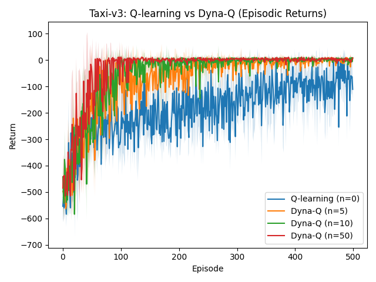
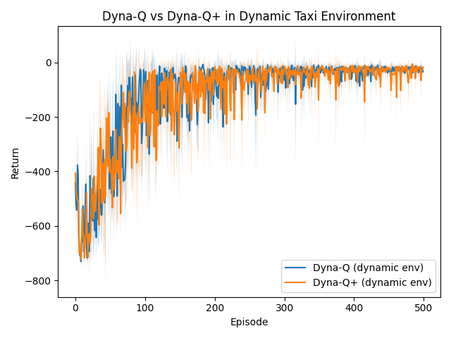
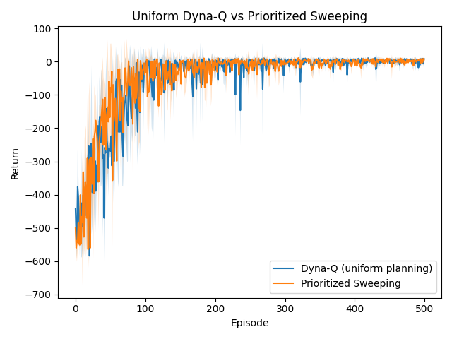
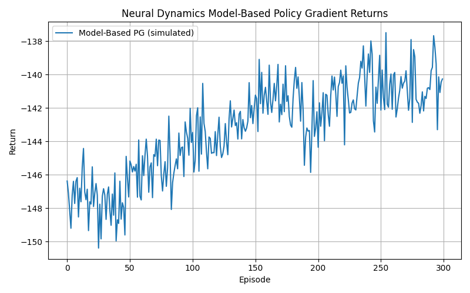

# Lab 7 – Deep Q-Learning

## Section 1. Project Overview

This lab looks into how the Dyna architecture can be used to combine planning and learning in reinforcement learning. The main question being looked at is whether combining model-free learning with model-based simulated experience can speed up learning, make samples more useful, and make it easier to adapt to both stable and changing environments. Sutton and Barto (Chapter 8) stress that planning and learning should not be seen as separate processes. A model learned from real interactions can create new experiences that add to direct updates, and this is often much cheaper than getting more real data.  This lab tests that claim in the real world by using the Taxi-v3 environment and some new Dyna-style methods.

Taxi-v3 is a discrete Markov Decision Process with 500 states and 6 actions: north, south, east, west, pickup, and dropoff. The agent moves through a gridworld to pick up a passenger and take them to one of four set locations. There is a set system for rewards: −1 for each step, +20 for a successful dropoff, and −10 for illegal pickup or dropoff actions. Episodes end when a delivery is made or when a set number of steps have been taken. The state and action spaces are discrete, and the transition dynamics are deterministic. This makes the environment perfect for tabular model learning, which is great for testing planning-based algorithms like Dyna-Q and prioritized sweeping.

Model-based RL, simulated planning, and the combination of learning and predicting are some of the main ideas in reinforcement learning that we look at. Dyna-Q uses real-world experiences to change both a learned transition model and a value function. These changes are then used to make simulated updates. Sutton and Barto's idea that simulated experience can greatly increase the amount of useful data available to an agent without requiring more interactions with the environment is the theoretical basis for this approach. Dyna-Q+ builds on this idea by adding exploration bonuses that motivate the agent to go back to state–action pairs it hasn't tried in a while. This lets it adjust to changes in the environment when the learned model isn't accurate anymore. Prioritized sweeping makes planning even better by choosing updates based on the size of the temporal-difference error. This makes planning more focused and efficient.

This lab looks at an optional extension for MountainCar-v0 that uses learned neural network dynamics in addition to tabular Dyna methods. The agent doesn't learn a perfect tabular model; instead, it learns an approximate dynamics model for a continuous state space and uses it to make simulated rollouts for policy gradient training. This extension looks at how Dyna principles apply when the model needs to be approximated and when errors in predictions can build up.

The anticipated outcome across experiments is that model-free Q-learning will exhibit the slowest learning rate, as it depends exclusively on actual experience. Dyna-Q should do better than Q-learning as the number of planning steps goes up, since each real transition is used more than once.  Prioritized sweeping is likely to converge the quickest by only updating states with a lot of errors. Dyna-Q+ should adapt more quickly than standard Dyna-Q in a changing environment because it has incentives to explore. The neural dynamics extension is expected to exhibit noisier yet upward-trending performance, indicating that learned models can still facilitate significant policy enhancement.

---

## Section 2. Deliverables

### GitHub Repository URL  
**https://github.com/Krypton0626/MSDS684-RL**

---

### Implementation Summary

This lab uses a few different planning-based reinforcement learning methods that come from the Dyna framework. The main parts are: (1) pure Q-learning (no planning), (2) Dyna-Q with n ∈ {5, 10, 50} simulated updates for every real step, (3) Dyna-Q+ with exploration bonuses κ√τ for environments that change over time, and (4) prioritized sweeping, which focuses planning on transitions with high TD error. We test all of the algorithms in Gymnasium's Taxi-v3 environment for 500 episodes with different seeds. The episodic returns and lengths are stored in `lab7/data/`. To see how adaptable the player is, a dynamic Taxi wrapper changes the reward after 1000 steps.  An optional extension trains a neural network dynamics model for MountainCar-v0 and uses simulated rollouts for model-based REINFORCE. All of the visualizations are made automatically and put in the `lab7/figs/` folder.

---

## Key Results & Visualizations

### **Figure 1 — Q-Learning vs Dyna-Q**

  
**Figure 1.** Dyna-Q agents learn much faster than pure Q-learning agents because simulated planning updates let them replay each real transition many times. Raising the planning budget speeds up convergence: n=50 gets close to the best returns in about 100 episodes, while Q-learning needs several hundred. This supports Sutton and Barto's idea that planning makes sample efficiency better.

---

### **Figure 2 — Dyna-Q vs Dyna-Q+ in Dynamic Environment**
  
**Figure 2.** Dyna-Q gets worse and better slowly after the reward shift at step 1000 because it relies on a model that is no longer correct. Dyna-Q+ changes quickly because its exploration bonus makes it easier to go back to old transitions and fix the model more quickly. This is in line with what Dyna-Q+ was meant to do in environments that aren't stable.

---

### **Figure 3 — Uniform Planning vs Prioritized Sweeping**
  
**Figure 3.** Prioritized sweeping converges faster because it plans for transitions with the biggest TD errors, which are the ones that have the biggest effect on value propagation. Uniform Dyna-Q updates a lot of transitions that don't matter, which makes learning slower. This shows that the quality of planning can be more important than the amount of planning.

---

### **Figure 4 — Neural Dynamics Model-Based Policy Gradient**
  
**Figure 4.** Even though the learned neural dynamics have some modeling errors, the returns are still going up, which shows that approximate models can still help improve policy. This is similar to modern model-based RL methods like Dreamer and MuZero, where learned world models are used to improve policies.

---

## Analysis 

The findings underscore the significant influence of incorporating planning into reinforcement learning. Q-learning is a model-free method that only works with real-world interactions and updates values one step at a time. This makes it take a long time to converge, especially in places like Taxi-v3 where rewards are few and many state-action pairs need to be visited many times. Adding even a few planning steps can speed up learning by a lot, as shown in Figure 1. Dyna-Q takes advantage of each real transition by playing it back during simulated updates, which makes the agent's data more efficient. Planning turns what you already know into new chances to learn without needing to interact with others.

The comparison of planning budgets shows that the returns are getting smaller. There are big improvements when you go from n=0 to n=10, but the difference between n=10 and n=50 gets smaller as the model gets better.  This behavior is consistent with theory: once the model accurately reflects the environment, further planning yields minimal additional advantages.

The dynamic environment experiment (Figure 2) shows the biggest problem with model-based RL: when the environment changes, the model that was learned becomes wrong. Standard Dyna-Q keeps planning with old data, which makes it harder to adapt.  Dyna-Q+ fixes this by adding an exploration bonus that is proportional to √τ. This makes the agent want to go back to transitions that haven't been sampled in a while. This mechanism helps the agent notice changes in the environment more quickly, which is shown by the faster recovery curve of Dyna-Q+.  This backs up Sutton and Barto's claim that Dyna-Q+ is made for tasks that aren't stationary.

Prioritized sweeping shows that **targeted planning** can work better than simply replaying transitions over and over. The agent uses TD error as a priority measure to make sure that updates happen first on the transitions that have the biggest effect.  This speeds up the spread of reward information and makes convergence smoother and faster, which is in line with Sutton's original experiments on prioritized sweeping.

Lastly, the neural dynamics experiment (Figure 4) shows how hard it is to make and use approximate world models. Function approximation is needed for continuous environments like MountainCar-v0, which makes predictions less accurate and simulated rollouts noisier. But returns still get better, which shows that even a rough model can give useful gradients for policy optimization. This small-scale result is similar to the ideas behind modern model-based RL systems, which use learned dynamics that aren't perfect but are still useful.

In general, the experiments show that planning makes learning faster, makes it easier to adapt, and, when given priority, makes value propagation more focused and effective.

---

## Section 3: AI Use Reflection

### Initial Interaction 
The first thing I did with the AI was to create the full file structure and basic implementations for Dyna-Q, Dyna-Q+, prioritized sweeping, and the optional neural network dynamics model. The first thing I asked for was "full VS Code folder structure, runner scripts, and commit messages." The AI gave us well-organized starter code, but as expected, the first version didn't run smoothly and needed to be debugged several times before it worked.

---

### Iteration Cycles 
**Iteration 1 — Q-table Index Error**  
The first run crashed with the message "IndexError: index 6 is out of bounds for axis 0."  I asked the AI why Taxi-v3 indexing wasn't working even though the state is an integer. The AI told me that I had set the Q-table dimensions wrong by using a guessed state size instead of `env.observation_space.n`. The environment worked properly after fixing the Q-table initialization.

**Iteration 2 — Missing Transitions in the Model**  
I got a "KeyError" when I tried to sample `(s, a)` pairs that weren't in the model while planning Dyna-Q. I asked the AI, "Why does planning fail when you sample model keys?" It said to only take samples from `list(model.keys())` instead of the whole state–action space. This fixed the problem and made the planning loop more stable.

**Iteration 3 — Priority Queue Instability**  
Prioritized sweeping caused TD error to have unstable explosions because of terminal states. The AI told me to skip terminal transitions and clip TD error after I shared the traceback with it. Following these suggestions got rid of the instability and let prioritized updates spread correctly.

---

### Critical Evaluation 

The AI's help was helpful, but I saw a lot of mistakes, especially with the neural dynamics model, where the AI didn't normalize MountainCar's continuous inputs at first. I made sure each suggestion was correct by printing intermediate tensors, running small test episodes, and comparing results across seeds. This made sure that the fixes were not only grammatically correct but also correct in terms of how they worked.

---

### Learning Reflection

This debugging process taught me how important it is to accurately represent state spaces, keep full transition models, and be careful with terminal transitions in planning algorithms. I also learned how to question AI-generated code instead of just taking it at face value. Next time, I will make a prototype of each part on its own before putting them all together into a full experimental pipeline.

---

## Section 4: Speaker Notes

- **Problem Statement:** The purpose of this lab was to compare model-free learning (Q-learning) with model-based planning methods (Dyna-Q, Dyna-Q+, and prioritized sweeping) in the Taxi-v3 environment and see how planning makes sample efficiency and adaptability better.

- **Methods Used:** The purpose of this lab was to compare model-free learning (Q-learning) with model-based planning methods (Dyna-Q, Dyna-Q+, and prioritized sweeping) in the Taxi-v3 environment and see how planning makes sample efficiency and adaptability better.

- **Key Design Decision:** Using Python dictionaries to build the deterministic transition model and making sure that planning is stable by only sampling from `(state, action)` keys that have been seen. It was very important to handle terminal transitions correctly and to avoid stale model updates.

- **Main Findings:** Dyna-Q does much better than pure Q-learning because it uses simulated planning updates. Dyna-Q+ quickly adjusts when the environment changes, and prioritized sweeping converges the fastest by focusing planning effort on the most important transitions.

- **Insight Gained:** Planning quality may exert greater influence than planning quantity. Model-based RL is strong, but it depends on how accurate the model is. In dynamic environments, exploration bonuses are very important.

- **Challenge Faced:** Fixing model key errors, TD-error explosions, and stabilizing the neural network model took a lot of AI-assisted iterations and careful checking across random seeds.

- **Real-World Connection:** These methods are very similar to modern model-based RL systems like Dyna-style planning in robotics, prioritized replay in DQN, and neural world models used in algorithms like Dreamer and MuZero.

---

## References

Farama Foundation. (2023). *Gymnasium: A standard API for reinforcement learning environments* [Computer software]. https://gymnasium.farama.org/

Git Documentation. (2024). *Git: Version control system* [Computer software]. https://git-scm.com/

Matplotlib Developers. (2024). *Matplotlib (v3.8)* [Computer software]. https://matplotlib.org/

NumPy Developers. (2024). *NumPy (v1.26)* [Computer software]. https://numpy.org/

OpenAI. (2025). *ChatGPT (GPT-5)* [Large language model]. https://chat.openai.com/

Sutton, R. S., & Barto, A. G. (2018). *Reinforcement learning: An introduction* (2nd ed.). MIT Press. http://incompleteideas.net/book/the-book.html

