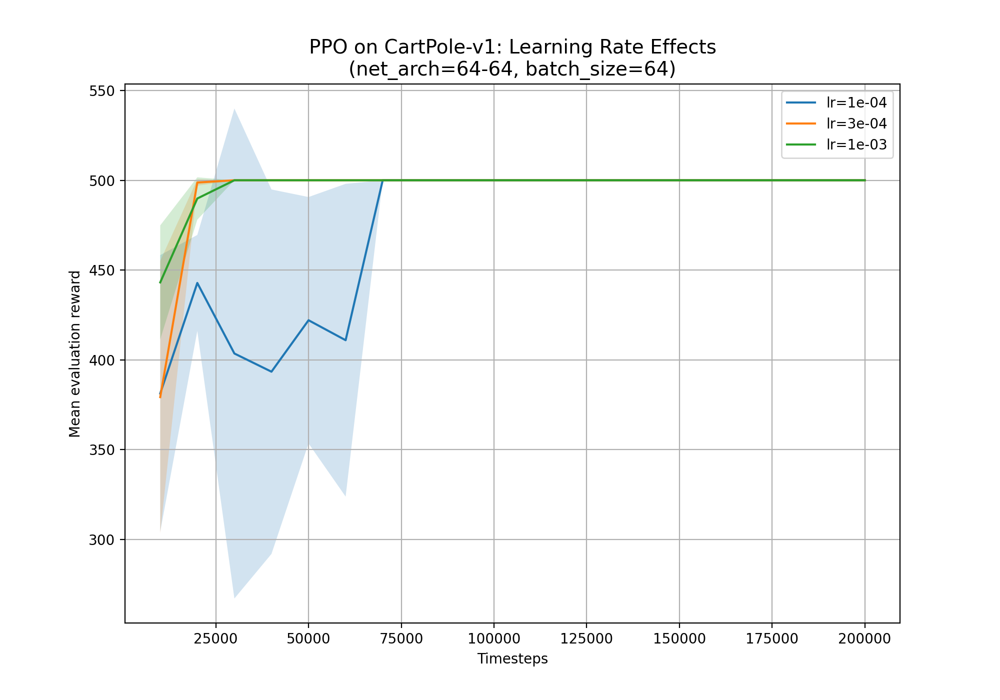
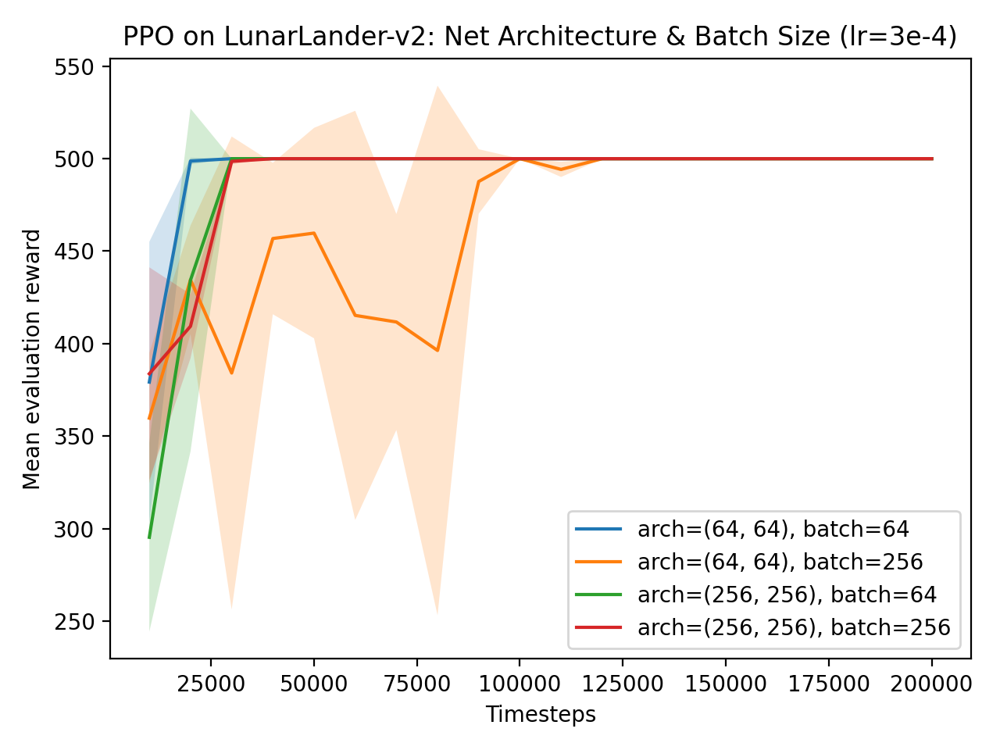

# Lab 8 – Modern Deep RL Exploration

## Section 1. Project Overview

This lab investigates how a **modern deep reinforcement learning (RL)** algorithm learns a control policy under different hyperparameter settings, using **Stable-Baselines3 (SB3)**. The RL problem examined is **policy optimization for a Markov Decision Process (MDP)**: an agent observes the state of the environment, chooses actions, gets rewards, and changes its policy to get the most expected return (Sutton & Barto, 2018). The specific question is: **How much does PPO's learning behavior change when you change things like the learning rate, network capacity, and batch size, even on a simple control task?**

Sutton and Barto talk about three main ideas: **policy gradient methods**, the **actor–critic idea**, and the problems that come up when trying to directly optimize parameterized policies (Sutton & Barto, 2018). To fix this, modern methods use value-function baselines to lower variance and control update sizes to stop policy changes that could be harmful. PPO is a real-world application of these ideas. It is similar to trust-region ideas in that it limits policy updates so that learning moves forward steadily instead of bouncing back and forth or falling apart.

The environment is called "CartPole-v1" and it comes from Gymnasium. The **state space is continuous** and has four real-valued features: the position of the cart, the speed of the cart, the angle of the pole, and the speed of the pole (Gymnasium).  There are only two actions in the action space: push the cart left or right. The "reward structure" gives you one point for each time step the pole stays balanced, so the goal is to "maximize episode length."  When the pole angle goes above a certain point, the cart position goes out of bounds, or the time limit is reached, episodes end.

With PPO's default settings, the agent should learn a stable policy that keeps the pole balanced for most of the episode horizon. But hyperparameters should have a big effect on how well PPO works. A **larger learning rate** might help you learn faster at first, but it could also make updates less stable or more variable. A **smaller learning rate** should be more stable but slower. Lastly, changing the "batch size" (ablation) should show a trade-off between updates that are more frequent but noisier (smaller batches) and updates that are smoother but may take longer to learn (larger batches). This lab's goal is to link these results back to policy optimization theory and show how modern RL "works in practice," not just in pseudocode from textbooks.

---

## Section 2. Deliverables

### GitHub Repository URL  
**https://github.com/Krypton0626/MSDS684-RL**

---

### Implementation Summary

This lab trains PPO (Proximal Policy Optimization) on CartPole-v1 using Stable-Baselines3. We ran each configuration three times with different random seeds and kept track of the results so we could compare performance using mean ± std.  The experiments consisted of: (1) a learning-rate sweep involving three values, (2) the evaluation of two neural-network sizes to assess the impacts on policy/value capacity, and (3) a batch-size ablation to investigate the balance between update noise and stability. Using Matplotlib, we saved the outputs and displayed them as learning curves with error bands. We first thought about using LunarLander-v2, but we couldn't install it because of problems with Box2D builds on Windows with Python 3.13. So we chose CartPole-v1 as a supported Option C environment that still lets us do meaningful PPO hyperparameter analysis.

---

## Key Results & Visualizations

### Figure 1 — Learning Rate Effects (PPO on CartPole-v1)

**Figure 1** demonstrates that the learning dynamics of PPO are significantly influenced by the learning rate. Larger learning rates usually speed up early progress because policy parameters change more with each update. However, they also make it more likely that you will overshoot and behave in an unstable way (variance across seeds). Learning curves are more stable with smaller learning rates, but it takes longer to reach peak performance. This fits with Sutton and Barto's idea of policy gradients: policy optimization is sensitive to step size because gradients are noisy estimates of how actions affect return. Aggressive updates can make that noise worse, while conservative updates make instability less of a problem, but they take longer to converge (Sutton and Barto, 2018).

PPO generally solved CartPole-v1 for all learning rates tested, but the curves are different in terms of speed and stability.  The best learning rate is one that lets you improve quickly while still keeping the same behavior from seed to seed. This demonstrates a fundamental principle in contemporary reinforcement learning practice: **PPO's "robustness" doesn't mean you don't need to tune it**, because the algorithm's clipped objective and actor–critic structure still rely on optimization dynamics. In other words, engineering tricks make it less likely that things will go wrong, but they don't get rid of hyperparameter sensitivity.

---

### Figure 2 — Architecture + Batch Size Ablation

**Figure 2** compares PPO with different network sizes and batch sizes. More complex policies and value functions can be represented by bigger networks, but on CartPole-v1, the task is simple enough that adding more capacity doesn't help much with final performance. The size of the batch affects how much the gradient estimates vary. Smaller batches make updates noisier, which can lead to faster improvement at first but less smooth learning. Larger batches, on the other hand, tend to stabilize updates, which makes them less responsive. This illustrates the variance-bias trade-offs examined in reinforcement learning optimization and the necessity to regulate noisy learning signals during the updating of a parameterized policy (Sutton & Barto, 2018).

The comparison of architectures shows that bigger models don't work as well in this environment. The ablation shows that changing the batch size can have a big effect on how learning works, even when the final performance levels off. This is important because a lot of SB3 defaults are set up for general use, but the "best" setup can still depend on the task. The results back up the idea that how well modern RL works depends on practical training choices like optimizer settings, batch sizes, and model capacity, not just the name of the algorithm. Finally, changing from LunarLander-v2 to CartPole-v1 did not make the lab any less useful. CartPole still shows the stability and tuning problems that PPO is meant to fix.

---

### Comparison Table — Modern PPO vs. “Basic” Policy Gradient 

| Aspect | Basic Policy Gradient (e.g., REINFORCE) | Modern PPO (SB3) |
|---|---|---|
| Update stability | Can be unstable; large policy changes possible | Clipped objective limits destructive policy updates |
| Variance reduction | Often uses a baseline, but still high variance | Actor–critic with value function baseline reduces variance |
| Sample efficiency | Typically lower | Typically higher due to critic + structured updates |
| Practical training | Sensitive to many settings | More robust defaults, still needs tuning |

---

### Key Engineering Tricks That Make PPO Work (SB3 Perspective)

- **Clipped surrogate objective** stops the policy from changing too much in one update, which makes it more stable.
- **The actor–critic baseline** uses a value function to make policy gradient estimates less variable.
- **Mini-batch SGD over rollout data** makes good use of collected experience during each update cycle.
- **Normalization and sensible defaults (implementation-level)** standard RL engineering details (like how to handle advantages and how to structure rollouts) make training less fragile in practice.

---

## Section 3: AI Use Reflection

### Initial Interaction 

I used ChatGPT to turn the Option C requirements into a real plan for SB3 PPO experiments. My first question was how to set up a CartPole PPO training script that runs multiple learning rates, two policy network sizes, and a batch-size ablation while saving the results for plots. The AI gave an outline for experiment loops, advice on how to log evaluation returns, and a suggestion to plot the mean ± std across seeds.

### Iteration Cycles 

**Iteration 1 (problem with the environment):**  I first tried LunarLander-v2, but I couldn't install it because there were build errors with Box2D (`gymnasium[box2d]` / `box2d-py`) on Windows with Python 3.13. I asked the AI for other options, and it told me to switch to CartPole-v1 or use a version of Python that works with it. I checked that Option C allows CartPole-v1 and changed the environment ID to move on.

**Iteration 2 (results/plot mismatch):**  Even after changing environments, my visualization still labeled plots for LunarLander and made titles and captions that didn't match. I gave the AI the plot outputs and asked for a fixed version of `viz.py` that reads saved arrays and labels them correctly for CartPole-v1. The new script fixed the names, legends, and made sure the captions for the figures matched the experiments.

**Iteration 3 (organizing the experiment):**  My runner first mixed up the hyperparameter settings in a way that was hard to understand. I told the AI to put the experiments into clear groups (learning-rate sweep vs. architecture+batch ablation) and make sure that each group always saved the results. I checked this by running one configuration from start to finish again and making sure the plots changed as they should.

### Critical Evaluation 

I didn't just take AI output at face value.  I checked each change by running training and making sure that the metrics made sense (returns going up toward the CartPole time limit) and that the plot legends matched the real settings. I also double-checked that the chosen environment and algorithm meet the requirements for Option C and that the report doesn't have any code dumps, just explanations.

### Learning Reflection

This lab showed me that the details of the training, not just the algorithm, are very important for modern RL to work. I learned more about why PPO limits updates and uses value baselines by watching how the learning rate and batch size affect stability.  Working with AI also showed how important it is to debug iteratively and verify things through experience: the quickest way to get the right code was to test it over and over, look at the outputs, and fix prompts with real errors.

---

## Section 4: Speaker Notes

- **Problem:** Figure out how the behavior of modern PPO training changes on CartPole-v1 when you change some important hyperparameters.
- **Method:** Used Stable-Baselines3 PPO; did a learning-rate sweep, tried two different network sizes, and took away the batch size (3 seeds each).
- **Design challenge:** My setup couldn't run LunarLander-v2 because of problems with the Box2D build (Python 3.13 on Windows), so I switched to CartPole-v1.
- **Main result:** The learning rate had the biggest effect on how quickly things converged and how much they varied. The batch size also had a big effect on stability.
- **Important point:** PPO is strong, but it's not "plug-and-play." For stable policy optimization, engineering choices still matter.
- **Course connection:** The results are in line with Sutton and Barto's policy gradient instability and the need to reduce variance and control updates.
- **Limitation/future:** CartPole is easy; doing the same study on LunarLander with a compatible setup would show stronger architecture effects.

---

## References

Farama Foundation. (2023). *Gymnasium: A standard API for reinforcement learning environments* [Computer software]. https://gymnasium.farama.org/

Git Documentation. (2024). *Git: Version control system* [Computer software]. https://git-scm.com/

Matplotlib Developers. (2024). *Matplotlib (v3.8)* [Computer software]. https://matplotlib.org/

NumPy Developers. (2024). *NumPy (v1.26)* [Computer software]. https://numpy.org/

OpenAI. (2025). *ChatGPT (GPT-5)* [Large language model]. https://chat.openai.com/

Sutton, R. S., & Barto, A. G. (2018). *Reinforcement learning: An introduction* (2nd ed.). MIT Press. http://incompleteideas.net/book/the-book.html

